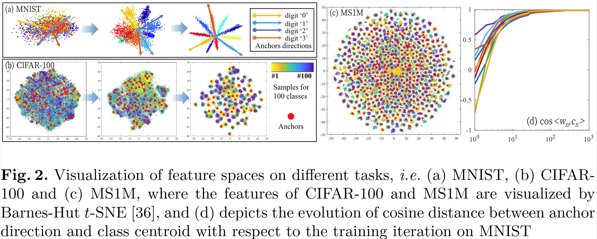

# Transductive Centroid Projection for Semi-supervised Large-scale Recognition

元の論文の公開ページ : [cvf](http://openaccess.thecvf.com/content_ECCV_2018/html/Yu_Liu_Transductive_Centroid_Projection_ECCV_2018_paper.html)  
Github Issues : 

## どんなもの?
最後の全結合層をTransductive Centroid Projection (TCP)と呼ばれるモジュールに替えて半教師あり学習(教師なし学習も?)を効率化する提案をした。貢献は以下の通り。

1. **観測による解釈** : モデルの収束に伴って、最後の全結合層の写像行列$\mathbf{W}$の各列(つまり$\mathbf{w}_ n$、以下アンカーと呼ぶ)の方向が徐々に重心と一致する観測を調査する。(この方向って、0からアンカーへの方向という意味か?)
2. **新規提案のTransductive Centroid Projection層** : 上記の観測に基づき、Transductive Centroid Projection(TCP)と名付けられた新規の層を導入し、識別能力を向上させる非/半教師あり学習メカニズムを提案する。self-traningのような反復処理を使わずともTCPは訓練することができる。
3. **顔認識とperson re-identification(ReID)で優れた実績** : 顔認識とReIDで教師/半教師あり学習に対する優位性の評価を行う。

## 先行研究と比べてどこがすごいの?
半教師あり学習でself-traningの様な反復処理を使わない、inter-class conflictの確率を減少させるという点。

## 技術や手法のキモはどこ? or 提案手法の詳細
### Observation inside the Softmax Classifier
まずは式(1)のような$\mathbf{y}$があり、$\mathbf{b} \equiv \mathbf{0}$であり、SGDによるソフトマックス損失の教師あり学習でうまく収束したとする。
この時、$\mathbf{w}_ {i}=\mathbf{W}_ {[i] } \in \mathbb{R}^{D}$(アンカー)が、クラス$i$の重心方向に向くことを観測する。観測するためにToy Examples (軽い実験)を行う。

$$
\mathbf{y}=\mathbf{W}^{T} \mathbf{f}+\mathbf{b} \tag{1}
$$

#### Toy Examples
前述の内容を観測するため、小規模データセットから大規模データセットまでの分類タスクを行う。使われるデータセットはMNIST(10クラス)、CIFAR-100(100クラス)、MS1M(100000クラス)の3つ。実験では表1のBackbornに示されているアーキテクチャをそれぞれ使う。各アーキテクチャの畳み込み後に全結合層のFC1とFC2を装着する。FC1は表1のFeature Dimと同じ次元(MNISTなら2次元)の特徴ベクトル$\mathbf{f}$を出力し、FC2はその$\mathbf{f}$をクラス空間へ写像する。(おそらく)FC1の結果を視覚化したものが図2である。以下、各データセットの結果を説明する。

##### MNIST
図2(a)は0,2,10エポックの結果を示す。徐々に特徴量の差異が表れている。0エポック時はアンカーの向きがランダムであったが、訓練していく過程で徐々に特徴量の重心の方向に向くことを確認した。図2(d)は、クラスの重心とアンカーの方向のコサイン類似度の移り変わりを示す。

##### CIFAR-100 & MS1M
図2(b,c)にその結果を視覚化する。これらはt-SNEを用いて次元削減したものを視覚化している。赤点がアンカーであり、アンカーが各クラスの重心の知覚にいることを観測した。

## どうやって有効だと検証した?

## 議論はある?

## 次に読むべき論文は?
- なし

## 論文関連リンク
1. なし

## 会議
ECCV 2018

## 著者
Yu Liu, Guanglu Song, Jing Shao, Xiao Jin, Xiaogang Wang.

## 投稿日付(yyyy/MM/dd)
2018/10/06

## コメント
なし

## key-words
2D_Image

## status
修正

## read
A, I, R, M

## Citation
@InProceedings{Liu_2018_ECCV,
author = {Liu, Yu and Song, Guanglu and Shao, Jing and Jin, Xiao and Wang, Xiaogang},
title = {Transductive Centroid Projection for Semi-supervised Large-scale Recognition},
booktitle = {The European Conference on Computer Vision (ECCV)},
month = {September},
year = {2018}
}