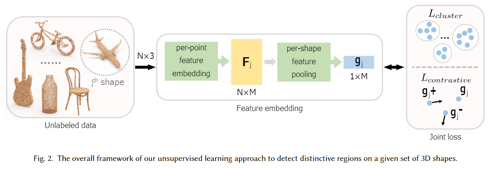
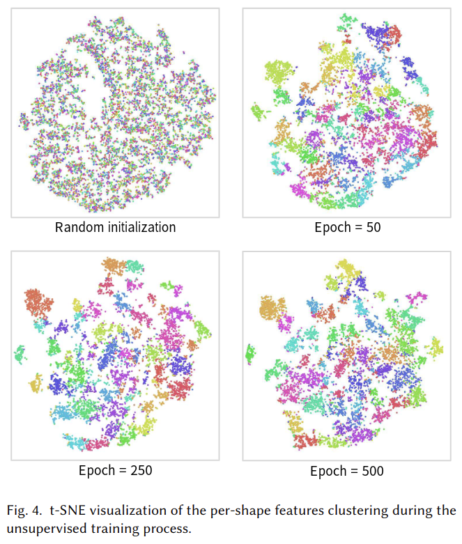
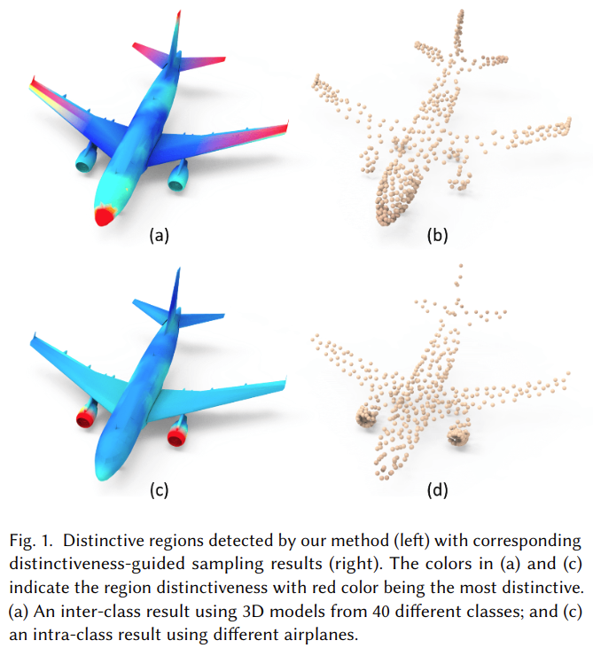

# Unsupervised Detection of Distinctive Regions on 3D Shapes

元の論文の公開ページ : [arxiv](https://arxiv.org/abs/1905.01684)  
Github Issues : [#108](https://github.com/Obarads/obarads.github.io/issues/108)

## どんなもの?
教師なしで3D形状のdistinctive region(以下識別領域と呼ぶ)を探す手法を提案する。貢献は以下の通り。

1. 識別領域を検知する教師なしアーキテクチャの提案した。
2. クラスタリングベースのノンパラメトリックソフトマックス分類器を設計し、教師なしでネットワークを学習するためのadapted contrastive lossを適応した。
3. 提案手法の評価と、識別性が3Dシーンの形状検索、サンプリング、視界選択にどのように貢献するか示す。

## 先行研究と比べてどこがすごいの?
クラスラベルを必要としない3D形状の識別領域検出が可能にしている。また、Grad-CAMなどのニューロン活動視覚化手法ではクラスラベルを必要とする方法を紹介しているが、本提案では教師なしで視覚化する。

## 技術や手法のキモはどこ? or 提案手法の詳細
提案では柔軟性と計算量の軽さから点群で形状の識別領域を予測する。提案手法の概要図は図2の通り。

### Overview
複数の形状$\mathcal{S}=\\{S_ {j}\\}_ {j=1}^{N_ {\mathrm{obj}}}$の集合が与えられたとき、その形状をかたどった点群$P_ {j}=\\{\mathbf{p}_ {i, j}\\}_ {i=1}^{N}$の特徴埋め込みを教師なしで学習し、そこから各形状中の局所の識別性$d_ {i,j}$を得ることを目的とする。各変数はそれぞれ、$j$は形状の番号、$N_ {obj}$は形状の個数、$N$は$P_ j$に含まれる点の数、$p_ {i,j}$は3次元座標を含む$j$番目のオブジェクトの$i$番目の点である。

### Feature Embedding
図2のFeature embeddingモジュールはパラメータ$\theta$を持つ埋め込み関数$f_ \theta$を学習する。この時、$j$番目の形状内にある$i$番目の点の埋め込み特徴$f_ {i,j}$は式(1)で表される。$f_ {i,j}$により、点レベルの識別性を測ることができるようになる。

$$
f_ {i,j} = f_ \theta(p_ {i,j}) \tag{1}
$$

提案手法では$f_ \theta$にPointCNNに基づいたモデルを利用する。

さらに、他のオブジェクと比べて識別できるような形状レベルの識別性を探すために先程の埋め込みをオブジェクトごとに集約する。点の数が$N$である時、式(2)の様に表すことができる。

$$
\mathrm{g}_{j}=\frac{\sum_{i=1}^{N} \mathrm{f}_{i, j}}{N} \tag{2}
$$

このモジュールが計算した２つの特徴量$f$と$g$をそれぞれローカル(点単位)特徴とグローバル(形状単位)特徴と呼ぶ。

### Clustering-based Nonparametric Softmax
一般的なソフトマックス分類器はラベルが無いと動かすことができない。一般的なソフトマックス関数は式(3)の通り。式(3)の$y_ j$は$j$番目のオブジェクトのクラスラベル、$C$はクラスの個数、$q\in\\{1,\ldots,C\\}$は$j$番目のオブジェクトに対するクラス割り当て、$\mathbf{w}_ {k}$は$k\in\\{1,\ldots,C\\}$番目のクラスに対する重みベクトル、$\mathbf{w}_ {k}^{T} \mathbf{g}_ {j}$は$g_ j$がどれほど$k$番目のクラスに一致しているかを測ることを表す。$\mathbf{w}_ {k}^{T} \mathbf{g}_ {j}$と$g_ j$の関係より、$w_ k$は$k$番目のクラスの指標とみなすことができる。

$$
P\left(y_{j}=q | \mathbf{g}_{j}\right)=\frac{\exp \left(\mathbf{w}_{q}^{T} \mathbf{g}_{j}\right)}{\sum_{k=1}^{C} \exp \left(\mathbf{w}_{k}^{T} \mathbf{g}_{j}\right)} \tag{3}
$$

教師あり学習では、クラスラベルとそれに対応する訓練データを用いて各クラスの$w_ k$を決定することができる。最近になって、[3]の観測により、$w_ k$はクラスに属する全ての特徴ベクトルの平均と一致するということがわかった。

本論文の場合、教師なしであるためラベルは無いがクラスタを使うことができる。そこで、クラスタリングに基づくノンパラメトリックソフトマックス分類器を定式化することで上記の観測を本研究の問題に当てはめる。具体的には、形状単位の特徴ベクトル(グローバル特徴)を反復的に再クラスタリングを行い、各クラスタの指標を推定することで各クラスタの平均特徴ベクトルを得る。確率$P\left(y_{j}=q | g_{j}\right)$を式(4)の様に近似することができる。式(4)の$C$はクラスタの数、$\overline{\mathbf{g}}_ {k}=\frac{1}{|\mathbb{C}_ {k}|} \sum_ {t \in \mathbb{C}_ {k} } \mathbf{g}_ {t}$はクラスタ$\mathbb{C}_ k$の全ての形状単位の特徴ベクトルにわたる平均特徴ベクトルを示す。ここで、著者らは$w_ k$に近似するような$\overline{\mathbf{g} }_ k$(クラスごと)を取る。

$$
P\left(y_{j}=q | \mathbf{g}_{j}\right) \approx \frac{\exp \left(\overline{\mathbf{g}}_{q}^{T} \mathbf{g}_{j} / \tau\right)}{\sum_{k=1}^{C} \exp \left(\overline{\mathbf{g}}_{k}^{T} \mathbf{g}_{j} / \tau\right)} \tag{4}
$$

更に、$\|\|\mathbf{g}_{j}\|\|=1$を強制するために$\mathrm{L}_ {2}$正規化層を付け加え、分布の濃度レベルを調節するために$\tau$(temperature parameter, 0.07)を使用する[5]。  
これを損失関数に組み込む場合、$P(y_ {j}=q | \mathbf{g}_ {j})$を最大化することを目的とするため、負の対数尤度を最小化するようにする。式(5)の通り。式(5)の$q$はクラスタ処理後の形状$S_ j$に振り分けられたクラスタを示す。

$$
L_{c l u s t e r}=-\sum_{j=1}^{N_{\mathrm{obi}}} \log P\left(y_{j}=q | \mathbf{g}_{j}\right) \tag{5}
$$

実験では、スペクトルクラスタリングを使い、各訓練エポック中にグローバル特徴$g_ j$をグループ化する。

### Adapted Contrastive Learning
特徴学習の効果を向上させるため、著者らはadapted cotrastive lossを導入する。この損失は、クラスタリングの結果がほぼランダムに近い状態である訓練開始時に特に重要となる。各訓練エポックでの入力点集合$P_ j$をアンカーとして、著者らは$P_ j$に対してpositive点集合サンプルを$P_ {j}^{+}$、negative点集合サンプルを$P_{j}^{-}$として形成する。この時、$P_ {j}^{+}$に関連するグローバル特徴$g _{j}^{+}$は$g_ j$に近く、逆に$P_ {j}^{-}$に関連する$g _{j}^{-}$は$g_ j$から遠いものとする。

- $P_ {j}^{-}$の場合、$P_ j$が属していないクラスタ内にある形状から点集合をランダムに選ぶ(?)。
- $P_ {j}^{+}$の場合、クラス内クラスタリング(クラスタ内じゃないの?)の結果は、訓練開始時では特に信用できないため、$P_ j$に属するクラスタからランダムに選ぶことはない。そうではなく、$P_ j$に関連する3D形状($S_ j$)上の別の点集合$P_ j^+$をリサンプリングして、$g_ j^+$を生成するためのネットワークに$P_ j^+$を渡す(?)。注意として、$P_ j^+$と$P_ j$は点サンプリングプロセスのランダム性のために異なる点集合と成るが、本質的にはそれらは同じオブジェクトとして表される(i.e.,$S_ j$)(?)。

著者らはadapted contrastive loss[5]を定式化するため、上記の3つ$\\{\mathbf{g}_ {j}, \mathbf{g}_ {j}^{+}, \mathbf{g}_ {j}^{-}\\}$を扱う。式(6)の通り。式(6)の$D$は特徴空間中のユークリッド距離を示す。$\lambda=2.0$。

$$
L_{\text {contrastive}}=D\left(\mathbf{g}_{j}, \mathbf{g}_{j}^{+}\right)+\max \left(0, \lambda-D\left(\mathbf{g}_{j}, \mathbf{g}_{j}^{-}\right)\right) \tag{6}
$$

これを使うことで、信頼性の高いサンプルを生成していく。

### End-to-end Network Training
以上より、このネットワークの損失関数は式(7)の様になる。

$$
L(\theta)=L_{c l u s t e r}+\alpha L_{\text {contrastive}}+\beta\|\theta\|^{2} \tag{7}
$$

学習手順自体は、再帰的に特徴ベクトルの学習を行い、それらを再クラスタリングし、モデルを微調整するためにクラスタリング結果を使うというものである。図3は学習プロセスを表したものである。図4は、これらの学習プロセスを経た形状ごとの特徴を可視化したものである。

### Obtaining and Visualizing the Distinctivenes
上記の学習で、グローバル特徴とローカル特徴$f_ {i,j}$($i$は点のインデックス)が学習できるため、$f_ {i,j}$の最大値をとってそして0~1の間で識別性$d_ {i,j}$を正規化する。その結果を形状に反映することで識別性を可視化する。可視化したものは図1の通り。

## どうやって有効だと検証した?
### Implementation Details
TensorFlow、ランダムサンプリングによる2048個の点の使用、$\alpha,\beta$はそれぞれ3.0と10の-5乗、訓練は500エポック、Adam optimizer、学習率は0.01となっている。$f_ \theta$(点の符号化)にPointCNNベースのアーキテクチャを採用する。アーキテクチャはKNNやgeodesic-like KNN[6]の代わりに固定サイズのquery ball(PointNet++と同じもの)を利用する。また、$\mathcal{X}$-convを外し、点ごとの特徴復元のための特徴補完(PointNet++参照)を直接使用した。こうすることで、品質低下をほとんどさせずにパラメータ数を減らした。また、補足資料でPointNetとPointNet++についても扱う。

### Detecting Distinctive Regions

## 議論はある?

## 次に読むべき論文は?
- なし

## 論文関連リンク
1. [Kai Zhang, James T. Kwok, Bahram Parvin. Prototype Vector Machine for Large Scale Semi-supervised Learning.](https://pdfs.semanticscholar.org/9809/2daf04509fc5cc615d39760451d58f458ecc.pdf)
2. [Kai Zhang, James T. Kwok, Bahram Parvin. Prototype Vector Machine for Large Scale Semi-Supervised Learning. ICML 2009.](https://icml.cc/Conferences/2009/papers/198.pdf)
3. [Yu Liu, Guanglu Song, Jing Shao, Xiao Jin, and Xiaogang Wang. 2018. Transductive centroid projection for semi-supervised large-scale recognition. In European Conf. on Computer Vision (ECCV). 70–86.](http://openaccess.thecvf.com/content_ECCV_2018/html/Weiwei_Shi_Transductive_Semi-Supervised_Deep_ECCV_2018_paper.html)
4. [Geoffrey Hinton, Oriol Vinyals, and Jeff Dean. 2015. Distilling the knowledge in a neural network. arXiv preprint arXiv:1503.02531 (2015).](https://arxiv.org/abs/1503.02531)
5. [Raia Hadsell, Sumit Chopra, and Yann LeCun. 2006. Dimensionality reduction by learn-ing an invariant mapping. In IEEE Conf. on Computer Vision and Pattern Recognition (CVPR). 1735–1742.](http://yann.lecun.com/exdb/publis/pdf/hadsell-chopra-lecun-06.pdf)
6. [Lequan Yu, Xianzhi Li, Chi-Wing Fu, Daniel Cohen-Or, and Pheng-Ann Heng. 2018. EC-Net: an Edge-aware Point set Consolidation Network. In European Conf. on Computer Vision (ECCV). 398–414.](https://www.researchgate.net/publication/328108835_EC-Net_An_Edge-Aware_Point_Set_Consolidation_Network_15th_European_Conference_Munich_Germany_September_8-14_2018_Proceedings_Part_VII)

## 会議
不明(提出先はSIGGRAPH?)

## 著者
Xianzhi Li, Lequan Yu, Chi-Wing Fu, Daniel Cohen-Or, Pheng-Ann Heng.

## 投稿日付(yyyy/MM/dd)
2019/05/05

## コメント
Adapted Contrastive Learningがよくわからん、PointCNNがもはや別物で笑ってしまった。

## key-words
Unsupervised_Learning, Point_Cloud, Analytics, CV

## status
修正

## read
A, I, R, M

## Citation
