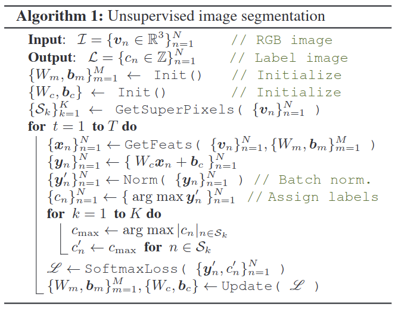
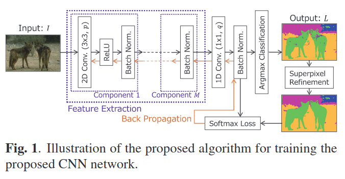

# Unsupervised Image Segmentation by Backpropagation

元の論文の公開ページ : [github.io](https://kanezaki.github.io/pytorch-unsupervised-segmentation/ICASSP2018_kanezaki.pdf)  
Github Issues : [#109](https://github.com/Obarads/obarads.github.io/issues/109)

## どんなもの?
$k$種類(ただし$k$は不明とする)のインスタンスラベルのうちのどれか一つを各ピクセルに割り振る教師なし学習アルゴリズムを提案した。

## 先行研究と比べてどこがすごいの?
省略

## 技術や手法のキモはどこ? or 提案手法の詳細
画像の各画素に含まれる特徴量を抽出し、それをクラスタリングで分割して各クラスタにそれぞれインスタンスラベルを振り分けるもの。これを教師なし学習を用いたアルゴリズムで行う。予想されるクラスタラベル$\\{c_ n\\}_ {n=1}^N$($N$は入力画像のピクセル数)が満たすべき基準は以下の通り。

1. 同じ特徴を持つピクセルには同じラベルを割り振る。
2. 空間的に連続したピクセル(隣接するピクセルなど)には同じラベルを割り振る。
3. 固有のクラスタラベルの数は多いほうが良い。

この３つ基準を同時に処理する段階的最適化を介して最適な$\\{c_ n\\}$を見つける。$\\{c_ n\\}$取得の流れは以下の通り。

1. [0,1]に正規化されたRGB画像$\mathcal{I}=\\{\boldsymbol{v}_ {n} \in \mathbb{R}^{3}\\}_ {n=1}^{N}$を畳み込み(FCN等)に入力する。
2. 畳み込みをえて、$\\{v_ n\\}$から$p$次元の特徴マップ$\\{x_ n\\}$を抽出する。
3. 線形分類器の適応により応答マップ$\\{\boldsymbol{y}_ {n}=W_ {c} \boldsymbol{x}_ {n}+\boldsymbol{b}_ {c}\\}_ {n=1}^{N}$を得る。このとき、$W_ c\in\mathbb{R}^{q\times p}$、$b_ c\in\mathbb{R}^{q}$である。結果として各ピクセルの特徴を$q$個のクラスに分類する。
4. 応答マップを$\\{y_ n'\\}$に正規化する。$\\{y_ n'\\}_ {n=1}^N$は平均が0、分散が1になるようにする。
5. $y_ n'$の中で最大となる次元を選択すること(argmax分類)で各ピクセルの$c_ n$を取得する。

以上の処理は、特徴ベクトルの一群を$q$個のクラスタに割り振ることと同じである。最終的な応答の$i$番目のクラスタ$\\{y_ n'\\}$は式(1)の様に書かれる。

$$
C_{i}=\left\{\boldsymbol{y}_{n}^{\prime} \in \mathbb{R}^{q} | y_{n, i}^{\prime} \geq y_{n, j}^{\prime}, \quad \forall j\right\} \tag{1}
$$

この時、$y_ {n,i}'$は$i$番目の$y_ n'$の要素である。

### Constraint on spatial continuity (空間連続性に対する制約)
ピクセルをインスタンスレベルで分割するのであるなら、それは隣接するピクセルと同じラベルを割り振るようにしたほうが良い。そこで、そのための制約を追加する。

1. 最初に入力画像から$K$個のスーパーピクセル$\\{\mathcal{S}_ {k}\\}_ {k=1}^{K}$を抽出する。この$\mathcal{S}_ k$は$k$番目のスーパーピクセルに属するピクセルのインデックスを示す。
2. 各スーパーピクセル内の全てのクラスタに同じクラスタラベルを割り振る。(この後のことをあとで具体的に書く)

スーパーピクセル抽出にはSLIC[1]を使い、$K=10000$とする。

### Constraint on the number of unique cluster labels (固有クラスタラベルの数に対する制約)
教師なしで画像内のセグメンテーションの適切な数を示さなければいけない。基準の(1)と(2)はピクセルのグループ化を推し進めるため、$q'=1$($q'$はクラスタの数)となる可能性がある。そこで基準の(3)に位置する制約を追加する。この制約は、argmax分類でクラスタラベルを取得する前にintra-axis正規化プロセスを応答マップ$\\{y_ n\\}$に適応することで実現する。ここで、式(2)で示されるバッチ正規化(ここでは、バッチが一個の入力画像の$N$ピクセルに対応する)を使う。

$$
y_{n, i}^{\prime}=\frac{y_{n, i}-\mu_{i}}{\sqrt{\sigma_{i}^{2}+\epsilon}} \tag{2}
$$

この時、$\mu_ {i}$と$\sigma_ {i}$はそれぞれ平均と標準偏差を表す。$\epsilon$は分散に対して加えられる数値安定性のためのもの。この操作はwhiteningとも呼ばれ、各軸は平均がゼロ、分散が1をもつ。(あとでこの後のことを付け加えること)

### Learning network by backpropagation (逆伝播によるネットワークの学習)
ここでは教師なし画像セグメンテーションのためのネットワークの自己訓練(self-train)の方法について述べる。ターゲット画像を入力とする時、以下の2つの問題が発生するため以下の方法で対処する。

- **問題** : 固定されたネットワークパラメータを用いてクラスタラベルの予測しなければいけない。  
	**解決** : 前者の過程はConstraint on spatial continuityの節で述べたスーパーピクセルによる方法を使用する。

- **問題** : (固定され)予測されたクラスタラベルを用いてネットワークパラメータの訓練(更新)しなければいけない。  
	**解決** : 教師あり手法と同様に勾配降下法による逆伝播を行う。

後者の方法は具体的に、損失はクラスタラベル$\\{c_ {n}^{\prime}\\}$とネットワークからの出力$\\{y_ {n}^{\prime}\\}$のソフトマックス損失を使う。この逆伝播を用いて分類器のパラメータ$\\{\boldsymbol{W}_ {c}, \boldsymbol{b}_ {c}\\}$同様、畳み込みフィルタのパラメータ$\\{W_{m}, \boldsymbol{b}_ {m}\\}_ {m=1}^{M}$更新する。

これらの更新アルゴリズムはアルゴリズム1に、ネットワークは図1に示される。

図1に示す著者らのネットワークには、最終畳み込み層とargmax分類層の間にバッチ正規化層があるという特徴がある。教師あり手法と違い、これはターゲットラベルが固定されているときに、合理的なラベル$\\{c_ n\\}$を得るためのresponses over axesのバッチ正規化が必要と成るためである(?)。

また、損失がゼロになるような$\\{c_ n\\}$の複数の解(DeepClustering等のクラスタ系学習手法で起こるものと同じだと思われる)が存在する。これらの解を促すクラスタリングとパラメータのアップデート間のバランスは学習率によって制御される。経験的に、学習率を0.1(with momentum 0.9)に設定することで最良の結果が得られることがわかった。

## どうやって有効だと検証した?

## 議論はある?

## 次に読むべき論文は?
- なし

## 論文関連リンク
1. [Radhakrishna Achanta, Appu Shaji, Kevin Smith, Aurelien Lucchi, Pascal Fua, and Sabine Süsstrunk, “Slic superpixels compared to state-of-the-art superpixel methods,” IEEE Trans. on Pattern Analysis and Machine Intelligence, vol. 34, no. 11, 2012.](https://ieeexplore.ieee.org/document/6205760)

## 会議
ICASSP 2018

## 著者
Asako Kanezaki.

## 投稿日付(yyyy/MM/dd)
2018/??/??

## コメント
なし

## key-words
RGB_Image, Unsupervised_Learning, CV, Paper, 省略, 旧版

## status
省略

## BibTex
@inproceedings{kanezaki2018_unsupervised_segmentation,
	title={Unsupervised Image Segmentation by Backpropagation},
	author={Asako Kanezaki},
	booktitle={Proceedings of IEEE International Conference on Acoustics, Speech, and Signal Processing (ICASSP)},
	year={2018},}