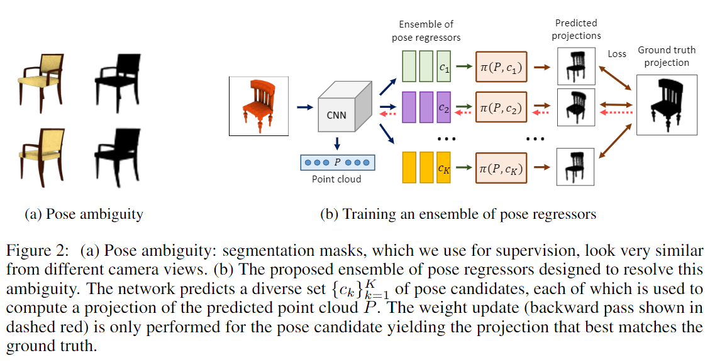
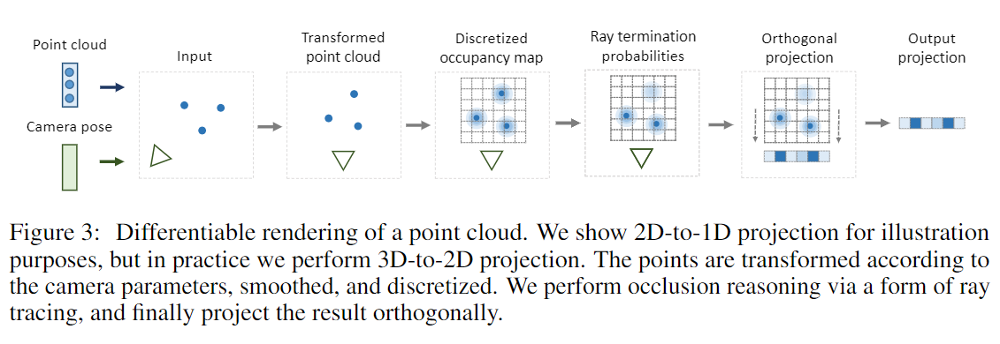

# Unsupervised Learning of Shape and Pose with Differentiable Point Clouds

元の論文の公開ページ : https://arxiv.org/abs/1810.09381

## どんなもの?
同じオブジェクトが映っている2枚の画像からカメラの向きと点群表現を予測し、画像から3D表現を生成するモデルを提案した。

## 先行研究と比べてどこがすごいの?
この研究と似た既存の研究では、訓練するのにカメラ位置の教師ラベルが必要であった。しかし、実際に用いるとなると、そのような教師ラベルが存在することはない可能性が高い。著者らは、ラベルなしでも学習が行えるモデルを提案した。

## 技術や手法のキモはどこ? or 提案手法の詳細
### **構造**
モデルは図1の通り。入力$x_　1$と$x_2$が与えられたとすると、点群表現の3D形状 $\hat{P}_ 1$ とカメラの位置$\hat{c}_ 2$を予測する。予測した3D形状と予測したカメラの位置から画像$\hat{p}_{1,2}=\pi(\hat{P}_1, \hat{c}_2)$を生成する($\pi$はdifferentiable point cloud render(もしくはprojection))。このとき、Ground truth projection(カメラ位置の予測で使った入力画像のシルエット)と生成された画像の比較を行い、それの差を損失関数とする。

### **Estimating pose with a distilled ensemble**
上記の実装だけではうまく形状予測ができないことが分かった。原因はlocal minima(局所極小値)によって引き起こされる。位置推定ですべてのオブジェクトのカメラの位置が後ろもしくは前に収束するためである。実際、図2の(a)を見ての通り、シルエットではどの方向から見ているか判別しづらい。  
この問題を緩和するため、カメラ位置を出力する関数をsingle pose regressor $F_c(・,\theta_c)$から、$K$ pose regressors $F_c^k(・,\theta_c^k)$のアンサンブル(図2の(b))に変更した。この訓練はhindsight損失(論文関連リンクの1など)を用いた損失関数を用いて訓練する。
このアイデアは各予測子はカメラ位置のサブセットに特化し、一緒に様々なカメラの位置をカバーできるようになるというものである(イメージとしては、ある予測子はオブジェクトを横から見るの専門、別の予測子は前から見る専門というものか)。  
アンサンブルのトレーニングを行いながら、アンサンブルから最良のモデルを教師として使用することでアンサンブルをsingle regressorに蒸留する。最良のモデルは損失に基づいて決められる。  
テスト時はアンサンブルを切除して蒸留されたregressorを使いカメラ位置を推定する。

### **Differentiable Point Clouds**
点群から二次元への投影は図3の流れの通り。図3では2次元から1次元にしているが、これは説明の都合上であり、実際は3次元から2次元にしている。点群と視点を軸方向に変換し、微分可能にするためそれぞれの点は平滑関数によって表現され、碁盤目状に離散化される。投影する際に、遮蔽点からのシグナルが前景点に干渉しないようにするため、論文関連リンクと同様に微分可能なray tracing定式化を使ってオクルージョンの推定を行う。

## どうやって有効だと検証した?
省略

## 議論はある?
省略

## 次に読むべき論文は?
なし

### 論文関連リンク
1. [A. Guzmán-rivera, D. Batra, and P. Kohli. Multiple choice learning: Learning to produce multiple structured outputs. In NIPS. 2012.](https://papers.nips.cc/paper/4549-multiple-choice-learning-learning-to-produce-multiple-structured-outputs)
2. [S. Tulsiani, T. Zhou, A. A. Efros, and J. Malik. Multi-view supervision for single-view reconstruction via differentiable ray consistency. In CVPR, 2017.](https://arxiv.org/abs/1704.06254)

### 会議
NIPS 2018

### 著者
Eldar Insafutdinov and Alexey Dosovitskiy.

### 投稿日付(yyyy/MM/dd)
2018/10/22

## コメント
なし

## key-words
2D_Image, Point_Cloud