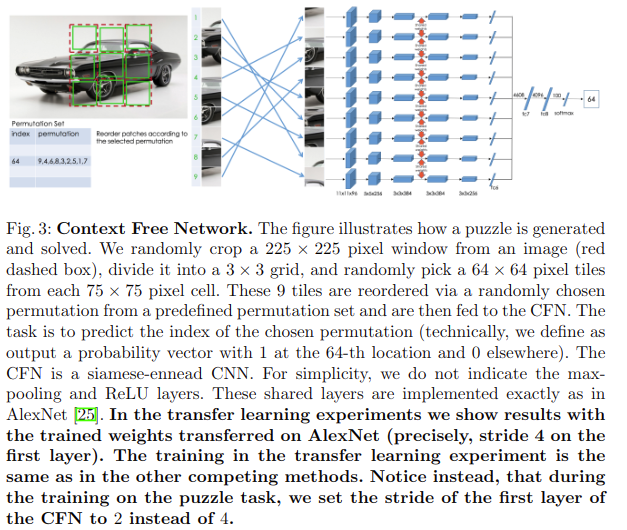
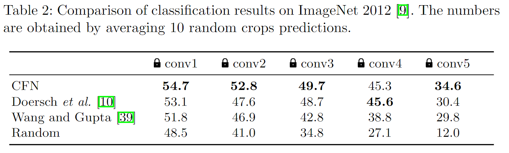
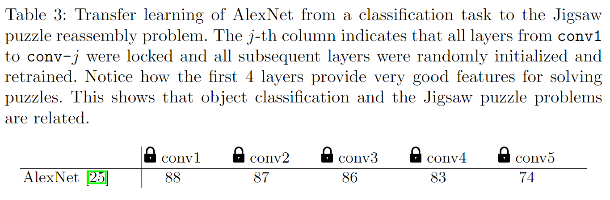

# Unsupervised Learning of Visual Representations by Solving Jigsaw Puzzles

## どんなもの?
pretextタスクとしてジグゾーパズルを解くself-supervisionモデル、Context-Free network(以下CFN)を提案した。

## 先行研究と比べてどこがすごいの?
ネットワーク側で見れる部分が個々のみである場合、個々の関連性は曖昧なままであったため、全ての部分を見ることができるようにした。

## 技術や手法のキモはどこ?
モデルは図3の通り。画像の中から255\*255ピクセルサイズの画像を取り出し、それを3\*3の基盤目(碁盤目のサイズは75\*75ピクセル)に分ける。基盤目からさらに64\*64ピクセルの画像を切り抜く。切り抜きの位置にジッタリング(ブレ)を使い、ギャップも入れることで低レベルな情報を用いたタスク解決(shortcut、ショートカット)を避けるようにする。その後、事前に定義されたpermutation set(このsetには順序ごとにインデックスが割り振られており、例えば図3ではインデックスの64番目は順列{9,4,6,8,3,2,5,1,7}のみがsetに書かれている)の中から一つ順序を選びその順序の通りCFNに入力される。そしてCFNはそのインデックス番号を予測する。なお、これらの順列はハミング距離に基づいて定義する(ハミング距離がジグゾーパズルの難しさを制御する)。

また、pretextタスクをこなすだけの2次元位置に関する情報(おそらく、絶対位置のこと(コメント参照))を学習するだけで意味的な特徴を持たない恐れがあるため、同じ画像で多様なジグゾーパズルをCFNに与える。当然ながら、論文関連リンクの2のAvoiding “trivial” solutionsの項目内容についても触れられている。

## どうやって有効だと検証した?

### **実装の詳細**
Titan X GPU\*1で論文関連リンクの6を使う。訓練ではImageNetから256\*256ピクセルのカラー画像を1.3M使い、ミニバッチは256バッチサイズである。画像は比率を守り、幅か高さが256ピクセルに一致するまでリサイズし、そこから他の次元(幅もしくは高さ)が256ピクセルになるようにトリミングする。トレーニングは350K回繰り返されたのちに学習率は0.01へ収束する。(Tesla K40の話は省略)

### **Pascal VOC**  
ジグゾーパズルタスクで得た特徴を、論文関連リンクの3のフレームワークを介してPASCAL VOC 2007の分類タスク、Fast R-CNN(論文関連リンクの4)を介してPASCAL VOC 2007の検知タスクへfine-tuningする。また、同じ重みを論文関連リンクの5のフレームワークを利用してPASCAL VOC 2012データセットのセマンティックセグメンテーションへfine-tuningする。結果は表1の通り。

### ImageNet Classification
AlexNet等のネットワークでは、最後の層が目的のタスクと使用されたデータセット固有の形になるのに対し、最初の層は汎用的なものになる。層を重ねるごとに汎用からタスク固有になることを踏まえ、ネットワークのどこで(汎用的に)特徴を抽出しているか調べる。表2にその結果を示す。鍵マークがついている層のみ重みをそのまま、その他の層はランダムな値で初期化される。尚、AlexNetを訓練した場合は最大57.3%の制度を得る(提案手法が?)。尚、全結合層のみで訓練した場合、提案手法は34.6%を達成する(?)。conv5に関してはconv5をまた訓練した場合、34.6%から45.3%に向上するため、conv5はジグゾーパズルのタスク(タスク固有の)向けの層になっていることがわかる。

追加で、分類タスクとジグゾーパズルのタスクの関連性を見る。AlexNetで分類タスクを学習させた後、学習した特徴を使いジグゾーパズルのタスクに使う。先ほどと同じように鍵の層の重さ固定&(多分)その層以外ランダム初期化する。その結果が表3であり、意味的な訓練は認識の役に立つことがわかる。

他にも、permutation setの実験、ショートカット予防に関する実験などいくつか行っている。

## 議論はある?
なし

## 次に読むべき論文は?
- [Doersch, C., Gupta, A., Efros, A.A.: Unsupervised visual representation learning by context prediction. ICCV (2015)](https://arxiv.org/abs/1505.05192)

### 論文関連リンク
1. [Self-supervised Learning による特徴表現学習](http://hirokatsukataoka.net/temp/cvpaper.challenge/SSL_0929_final.pdf)
2. [Doersch, C., Gupta, A., Efros, A.A.: Unsupervised visual representation learning by context prediction. ICCV (2015)](https://arxiv.org/abs/1505.05192)
3. [Krahenbuhl, P., Doersch, C., Donahue, J., Darrell, T.: Data-dependent initializa-tions of convolutional neural networks. ICLR (2016) ](https://arxiv.org/abs/1511.06856)
4. [Girshick, R.: Fast r-cnn. ICCV (2015)](https://arxiv.org/abs/1504.08083)
5. [Long, J., Shelhamer, E., Darrell, T.: Fully convolutional networks for semantic segmentation. In: CVPR (2015)](https://arxiv.org/abs/1605.06211)

### 会議
ECCV 2016

### 著者/所属機関
Mehdi Noroozi and Paolo Favaro.

### 投稿日付(yyyy/MM/dd)
2016/03/30

## コメント
In this case, the features Fi would carry no semantic meaning, but just information about an arbitrary 2D position.(この場合、特徴Fiは意味を持たず、任意の2D位置に関する情報のみを持つ。)の意味が明確に理解できていない。おそらくは、同じ画像で同じギャップやジッタリングを持ったものを何度も学習させると、その決まったパターンでしか認識できなくなるからか? その影響を避けるために、同じ画像でも様々なパターンのジグゾーパズルをCFNで使う。