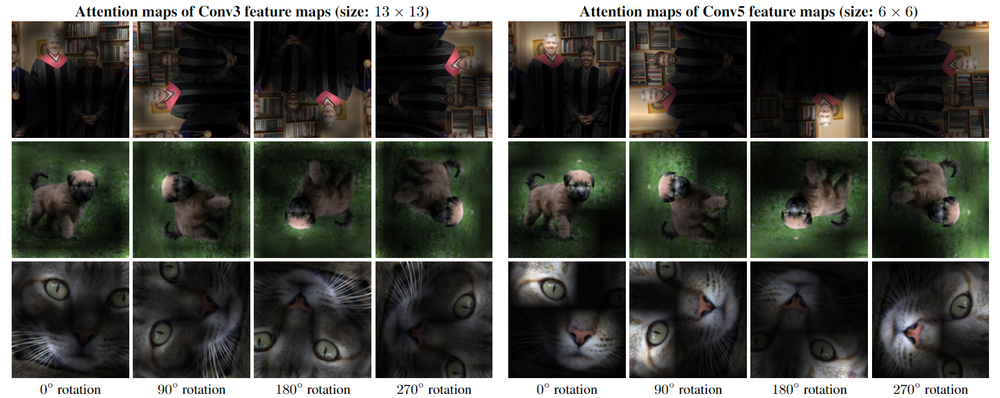
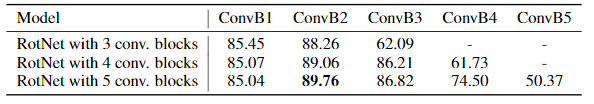
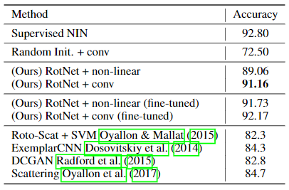
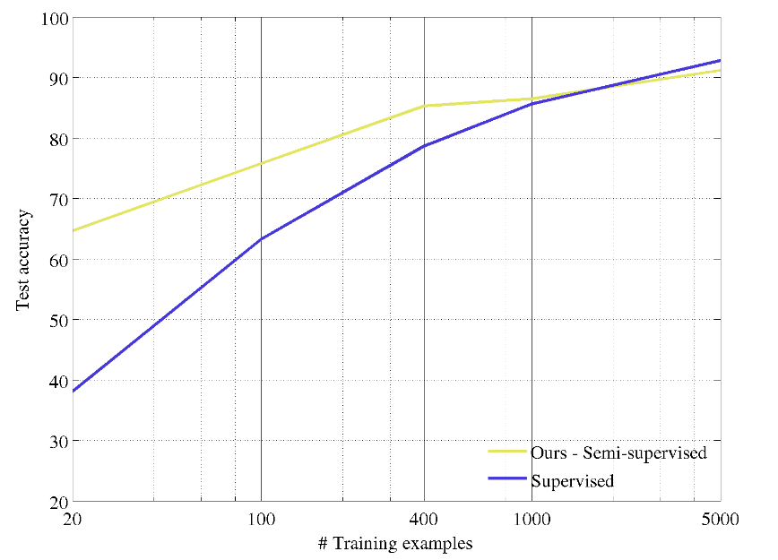
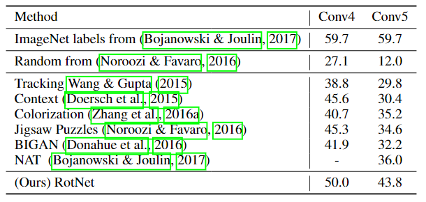
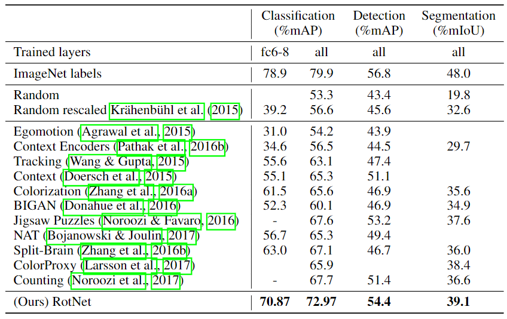
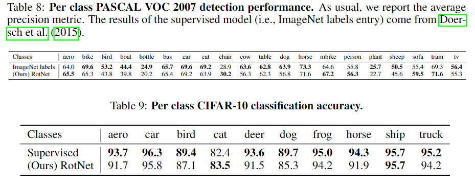

# Unsupervised Representation Learning by Predicting Image Rotations

元の論文の公開ページ : [arxiv](https://arxiv.org/abs/1803.07728)  
Github Issues : [#6](https://github.com/Obarads/obarads.github.io/issues/6)

## どんなもの?
入力として得られる画像に適応された2Dの回転を認識するようにConvNetsを訓練させて画像特徴を学習するself-supervised学習を行うRotNetを提案した。実装自体はあまりにも簡単であるため、結果への考察が主となる。

## 先行研究と比べてどこがすごいの?
既存のself-supervised学習の研究は教師あり学習の精度になかなか追いつけないものが多かった。しかし、今回提案するRotNetはシンプルな考え方でありながら、既存のそれらの学習方法を大幅に上回り、教師あり学習との結果を肉薄にするものとなった。

## 技術や手法のキモはどこ? or 提案手法の詳細
RotNet自体は以下の通りすごくシンプル。

幾何学変換の集合としてこれらの画像の回転をを使う背景にある中心的な直観は簡単な事実に関連するものである。その事実とは、ConvNetモデルが、画像内で意味的な部分などの物体のクラスを検出又は認識することを最初に学ばない限り、上記の回転認識タスクを効果的に実行することは本質的に不可能であるということである。つまり、画像の回転の予測に成功するために、ConcNetは画像中の目立つ部分を見つけ出しことを必ず学び、物体のタイプと姿勢を検知し、そして物体の姿勢と利用する画像の中でそれぞれの物体のタイプで描写される傾向から最も有力な姿勢と関連付けなければならない。

つまり、画像の向きを推測するために画像から回転方向を判断しやすい特徴を取らなければならず、その過程で物体のタイプや位置、方向を認識するための特徴を学習することに繋がるということである。例えば、画像に犬が映っている(物体のタイプ)場合は頭(位置)が上(方向)にあり足(位置)が下(方向)にあればその画像は回転していない(推測した方向)ということがわかる。下図は注目マップと呼ばれ、モデルがどこを注目しているか視覚化したもの。左が教師ありモデル、右がRotNetである。

下は回転させた画像に注目マップを施したもの。回転しても大体同じ部位を捕捉している。Conv3とConv5を比べてわかる通り、階層が進むごとに注目する箇所が集中している。

## どうやって有効だと検証した? 

### CIFAR-10による評価
最初にCIFAR-10の物体認識タスク上で、提案された回転認識のself-supervisedタスクによる特徴学習を基とするConvNetを評価する。ここで、回転認識のself-supervisedタスクで訓練されたConvNetモデルをRotNetと呼ぶ。

#### 学習された階層の評価
はじめに、学習した特徴の品質が深さ(層の深さ)やRetNetモデル全体の深さからどのように依存しているか調査する。

1. まずは、畳み込みブロックが3、4、5個ある3つのRotNetモデル(基となるNetwork-In-Network(以下NIN)アーキテクチャでは1つの畳み込みブロックに3つの畳み込み層があるため、層は9、12、15個となる)にCIFAR-10を使ったトレーニングを行う。  
1. 次に、それぞれの畳み込みブロックによって生成された特徴マップの上部で分類器を学習する。これらの分類器にはCIFAR-10の教師あり訓練手法を使う。分類器は3つのFC層からなり、2つの隠れ層には200の特徴チャンネルがあり、バッチノルム、Reluユニットと続く。

結果は以下のようになった。

2番目以降のブロックは精度が下がっているが、これは技術や手法のキモはどこ?でも示した通り、層が進むごとに回転予測のself-supervisedタスクでどんどん明細になるからである(でもなんで下がるんや...?)。 また、RotNetの総深度が増えると前の層(と1番目のconvブロックの後)によって生成された特徴マップにより、物体検知パフォーマンスが向上することを観測できた。これは、モデルの深さを増やすことで頭部の複雑さ(上部のConvNet層)は前の層の特徴を回転予測タスクにあまり特化しない様にさせる。(?)

#### 角度の選定
もっとも精度が良いのは4つのパターンのときである。物体検出には2つのクラスだけでは少なすぎ、逆に8つの場合は十分に区別できない上に135°など奇数の角度の際に現れる副作用(おそらく線の曖昧さの増幅)によって効果が下がると考えられる。また、0と180度の組と90と270度の組では後者のほうが低いが、これは単に制度を測る際の方向(0度)に沿った学習がうまくできていないため。結果は以下の通り。

#### 教師ありと他の教師無しとRotNetの比較
ここでは、合計で4つのconvブロックを持つRotNetモデルの二番目のConvブロックで生成された特徴マップを使う。これらのRotNetで2つの異なる分類器を使い訓練する。

- 従来通りの非線形分類器に3つのFC層を使う(RotNet + non-linear)。
- 3つのconv層と線形予測層(RotNet + conv)

尚、分類器より前の構造は3つのNINモデルのブロックからなる。最初の2つはRotNetのモデルを使うが、3つ目はランダムな初期化がされる。  
以上の設定を用いた結果は以下のようになる。

#### 物体分類と回転予測のタスクの相関関係
下図の通り。回転予測の精度が上がるごとにどんどんself-supervisedメソッドの精度が上がっている。

#### 半教師あり学習としての評価とセッティング
評価で使ったRotNet+convの形式を使用し、中身の特徴マップも同様のものを使用する。また、下図のexamplesは各カテゴリのそれぞれの例の個数を表す。少ない例である場合、教師あり学習を上回るという結果を示している。(多い場合に逆転されるのは、CIFAR-10のデータセット内に極端な例が混じっているせいで精度が落ちるからか?)

### ImageNetによるSelf-supervisedな特徴学習の評価
ここでは、RotNetのパフォーマンスをImageNet、PlacesやPASCAL VOC datasetsを使って評価する。ImageNetの画像を用いてRotNetを学習させ、ImageNetの分類タスクやPlaces、PASCAL VOC datasetsでの物体認識や物体セグメンテーションタスクをこなす。

#### ImageNetの分類タスク
非線形分類器による結果は以下の通り。

線形分類器(ロジスティクス回帰)による結果は以下の通り。

#### PASCAL VOCの分類、認識、セグメンテーションタスク
fine-tuningを使いタスクを行う。結果は以下の通り。

#### Placesの分類タスク
線形分類器(ロジスティクス回帰)による結果は以下の通り。この場合、学習された特徴は、監督されていない訓練フェーズ中に「見えない」クラスについての一般化によって評価されることに留意されたい。(?)

### 補足
行ったタスクの詳細結果

## 議論はある?
いろいろできそう

## 次に読むべき論文は?
- なに読もう

## 論文関連リンク
1. 本論文:https://arxiv.org/abs/1803.07728
2. 実装:https://github.com/gidariss/FeatureLearningRotNet

## 参考リンク
1. https://orizuru.io/blog/machine-learning/unsupervised/

## 会議
ICLR 2018

## 著者/所属機関
Spyros Gidaris, Praveer Singh, Nikos Komodakis

## 投稿日付(yyyy/MM/dd)
2018/03/21

## コメント
単純なのに強力である。こんなにも簡単な手法があるとは思わんかった。

## key-words
RGB_Image, Self-Supervised_Learning

## status
更新済