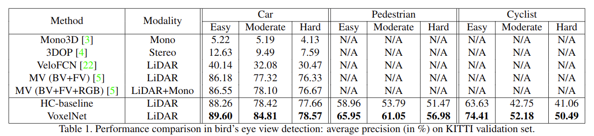
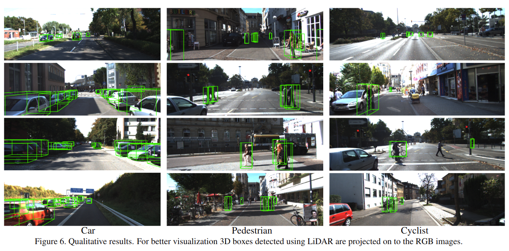

# VoxelNet: End-to-End Learning for Point Cloud Based 3D Object Detection 

元の論文の公開ページ : [arxiv](https://arxiv.org/abs/1711.06396)
提案モデルの実装 : [非公式:qianguih/voxelnet](https://github.com/qianguih/voxelnet)  
Github Issues : [#15](https://github.com/Obarads/obarads.github.io/issues/15)

## どんなもの?
##### LiDAR等で得られる大量の点(\~100k)に対しても3D検出タスクが行えるモデル、VoxelNetを提案した。
- VoxelNetは既存の手法で使われてきた手作業(hand-crafted)の特徴量の設計を必要とせず、特徴抽出とオブジェクトの境界ボックスの予測を行う汎用的でEnd-to-Endな3D検知ネットワークである。
- 処理の流れは以下の通り。
    1. グリッド状に分割した点群から、特徴量を詰め込んだスパースなtensor表現を生成する。
    2. 生成した表現を、3D畳み込みに入力して新たな表現(特徴マップ)を得る。
    3. 新たな表現をRegion Proposal Network(RPN)へ入力して、物体候補領域を推定する。

##### KITTIデータセットを使って提案モデルの実証をした。
- [投稿日: 2017/11/17]
- KITTIデータセットのLiDAR-base car, pedestrian, cyclist検出ベンチマークでSOTA。

##### [論文のポイントは、LiDAR点群をどうやってまとめ上げているかという部分。]
- [投稿日: 2019/12/18時点での自分の観点より。]
- [理由配下の通り。]
    - [Convolutional Middle LayersやRegional Proposal Networkは新しいと思える部分がない。]
    - [新規の特徴量取得方法により、LiDAR点群のような点が多いものに対する処理もEnd-to-Endな処理も可能になった。]

## 先行研究と比べてどこがすごいの?
##### 手作業の特徴量を使わない。
- 手作業の特徴量は、3D形状情報と[(回転)]不変性の効率的な活用を妨げるボトルネックとなっている。本提案アーキテクチャでは、深層学習の訓練をEnd-to-Endで行うことができる。

##### LiDARで得られる点の数(~100k)にも対応できる。
- PointNetやPointNet++で実証されている点の数はLiDARよりも少ない(\~1k)。本提案では、liDARが得る点の数(\~100k)にも対応できるようになっている。
- [このPointNetの点の数は1k以下、つまり1000以下ではなく、1000単位と言う意味だと思われる。つまり、VoxelNetも10万単位で処理できるということ?]

##### LiDAR単体で検出が可能である。
- LiDARにカメラを追加することで、より高い検出パフォーマンスを得ることができる。しかし、LiDARとカメラの同時運用は同期処理とキャリブレーションが必要となり、結果として用途の制限を招く。[具体的には?]また、センサーの故障により敏感になる。

## 技術や手法のキモはどこ? or 提案手法の詳細
### 手法の概要
- 流れは以下の通り。概要図は図2の通り。

##### 1. はじめに、点群をグリッド状に分割する。
- このとき、各ボクセル(セル)の点の数は一律ではない。

##### 2. $T$個以上の点を含む各ボクセル(セル)で$T$個の点をランダムサンプリングする。
- 各ボクセルの点の数の最大値を$T$個に固定することで以下の利点がある。
    - ボクセル間の点の不均等を減らすことができる。
        - [個数に偏りがあると、ネットワークが注目する部分に偏りができる?]
    - 計算がしやすくなる。
        - [プログラムを書いているとわかるが、GPUで計算する際は固定次元数の配列で計算する。そのため、点の数の最大値は固定したほうが計算しやすい。]

##### 3. 点を含むボクセルに対してVoxel Feature Encoding layerを適応して、ボクセルごとの特徴量を得る。
- 細かい説明はStacked Voxel Feature Encodingで行う。

##### 4. ボクセルごとの特徴量をまとめ、Sparse 4D Tensorを作成する。
- サイズはボクセルの数×ボクセルごとの特徴量の次元数。
    - ボクセルの数には点がないボクセルも含む。
- 基本的に90%のボクセルは空であり、空ではないボクセル特徴をsparse tensorとして扱うことは学習時のメモリ使用率や計算量を減らすことができる。
    - スパースな表現に対する処理では、効率的な計算の実装ができるという点で重要となる。

##### 5. Convolutional Middle LayerにSparse 4D Tensorを入力し、特徴マップを取得する。
- 畳み込みは3D畳み込みを使用する。

##### 6. 特徴マップをRegion Proposal Network(RPN)へ入力し、候補領域の推定を行う。
- 具体的には、確率スコアマップと回帰マップを取得する。
- 概要図は図4の通り。RPN自体には、いくつか変更が加えられている。

### 損失関数
##### Faster R-CNN[1]の損失関数をベースとしたものを使用する。
- 損失は式(2)の通り。Faster R-CNNの損失関数を参考にしている。

$$\begin{aligned}
L &=\alpha \frac{1}{N_{\text {pos }}} \sum_{i} L_{\text {cls }}\left(p_{i}^{\text {pos }}, 1\right)+\beta \frac{1}{N_{\text {neg }}} \sum_{j} L_{\text {cls }}\left(p_{j}^{\text {neg }}, 0\right) \\
&+\frac{1}{N_{\text {pos }}} \sum_{i} L_{\text {reg }}\left(\mathbf{u}_{i}, \mathbf{u}_{i}^{*}\right)
\end{aligned} \tag{2}$$
- クラス損失と位置・範囲・方向の損失を足し合わせたもの。
    - 最初の2項はnormalied classification損失となっている。
        - $L_ {\text{cls}}$はバイナリクロスエントロピー損失。
    - 最後の項は回帰損失であり、smooth L1関数を使用している。
- $p_ i^{\text{pos}}$と$p_ j^{\text{neg}}$はそれぞれpositiveアンカーとネガティブアンカーのソフトマックス出力。
- $\mathbf{u}_ {i} \in \mathbb{R}^{7}$と$\mathbf{u}_ {i}^{*} \in \mathbb{R}^{7}$はpositiveアンカーに対する回帰出力の誤差とpositiveアンカーに対するground-truthの誤差を示す。

##### 損失にオブジェクトの向きの誤差を追加する。
- 式(2)の$\mathbf{u}_ {i}^{*} \in \mathbb{R}^{7}$に関する値は式(1)の残差をすべて足したものである。
- [$\mathbf{u}_ {i} \in \mathbb{R}^{7}$も同じように計算する。大本である[1]も同じことをしている。]
$$\begin{aligned}
&\Delta x=\frac{x_{c}^{g}-x_{c}^{a}}{d^{a}}, \Delta y=\frac{y_{c}^{g}-y_{c}^{a}}{d^{a}}, \Delta z=\frac{z_{c}^{g}-z_{c}^{a}}{h^{a}}\\
&\Delta l=\log \left(\frac{l^{g}}{l^{a}}\right), \Delta w=\log \left(\frac{w^{g}}{w^{a}}\right), \Delta h=\log \left(\frac{h^{g}}{h^{a}}\right)\\
&\Delta \theta=\theta^{g}-\theta^{a}
\end{aligned} \tag{1}$$
- 残差にはオブジェクトの中心座標に関わる$\Delta x, \Delta y, \Delta z$、範囲に関わる$\Delta l, \Delta w, \Delta h$、向きに関わる$\Delta \theta$がある。
- $a$がついているものはアンカーのパラメーター、$g$がついているものはground-truthのパラメーター
- $d^{a}=\sqrt{\left(l^{a}\right)^{2}+\left(w^{a}\right)^{2}}$はアンカーの対角線である。
- ベースの大本とは異なり、3Dボックスの向きを示す$\Delta\theta$も追加する。

### 工夫
#### Voxel feature encoding (VFE) layer
##### 点ごとの特徴量を作成するためにVoxel feature encoding layerを導入する。
- Voxel feature encoding (VFE) layerは点を含むボクセル内にある各点の特徴量を作成する。
- VFE layerの全体像は図3の通り。
- この層の過程を以下に示す。

##### はじめに、各ボクセルで入力特徴セット(Point-wise input)を作成する。
- 特徴セットでは点の座標の他に、ボクセル内の重心点からの相対距離、received reflectanceを受け取る。
    - 重心点を$v_ x, v_ y, v_ z$で表すとき、特徴セット$\mathbf{V}_ {in}$は以下のように示される。
    - $\mathbf{V}_ {\mathrm{in}}=\\{\hat{\mathbf{p}}_ {i}=[x_ {i}, y_ {i}, z_ {i}, r_ {i}, x_ {i}-v_ {x}, y_ {i}-v_ {y}, z_ {i}-v_ {z}]^{T} \in \mathbb{R}^{7}\\}_ {i=1 \ldots t}$
        - $t \leq T$であり、$T$はボクセル内の点の数の最大値。
    - [相対距離を取ることで、ローカル特徴を取得している?]

##### 次に、入力特徴セットをfully connected network(FCN)に入れる。
- BNとReLUで構成された普通の層。

##### 次に、FCNの出力(Point-wise Feature)をElement-wise Maxpoolに入力する。
- [PointNetでも使われてたものだと思われる。]

##### 最後に、FCNの出力とElement-wise Maxpoolの出力(Locally Aggregated Feature)を連結する。
- [PointNetのセマンティックセグメンテーションモデルでも、点ごとの特徴量とプーリングで得た特徴量を連結している。]
- このような形にすることで、点周りの特徴(local feature)と点自身の特徴を融合して処理できる。

#### Stacked Voxel Feature Encoding
##### このVFE層をいくつか連続させることで、より説明可能な形状特徴情報を生成できる。
- [VFE-1層では座標値を入れていたが、2層目以降は入力の特徴値を元に、VFE層の計算を行う。]

##### 点を含むボクセルごとの特徴量は、VFE-$n$層の出力をElement-wise Maxpoolすることで得られる。
- この処理を行うことで、点ごとの特徴量からボクセルの特徴量を得ることができる。

### その他
##### その他にも効率的な実装、実装の詳細などが載っている。

## どうやって有効だと検証した?
KITTI 3Dオブジェクト検知ベンチマーク(論文関連リンクの3)を用いて評価した。鳥瞰図検知は表1に、3D検知は表2にVaidation setによるそれぞれ結果が載せられている。これらは3つの難易度で評価されている。

KITTIのTest setによる結果も表3に見せている。

図6は検知の例をRGB画像とbounding boxで表示させたもの。ただし、検知処理自体にRGBデータは用いられていない。

TitanX GPUと1.7GhzのCPUによる動作では一回の推論に33msかかる。これはvoxel input feature computationに5ms、feature learning networkに16ms、convolutional middle layersに1ms、RPNに11ms取られているからである。

## 議論はある?
RGB画像とLiDARを併用したEnd-to-Endな3D検知を行うことができれば、精度が更に向上するとしている。

## 次に読むべき論文は?
- [S. Ren, K. He, R. Girshick, and J. Sun. Faster r-cnn: Towards real-time object detection with region proposal networks. In Advances in Neural Information Processing Sys-tems 28, pages 91–99. 2015.](https://arxiv.org/abs/1506.01497)

## 論文関連リンク
1. [S. Ren, K. He, R. Girshick, and J. Sun. Faster r-cnn: Towards real-time object detection with region proposal networks. In Advances in Neural Information Processing Sys-tems 28, pages 91–99. 2015.](https://arxiv.org/abs/1506.01497)
2. [R. Girshick. Fast r-cnn. In Proceedings of the 2015 IEEE International Conference on Computer Vision (ICCV), ICCV ’15, 2015.](https://arxiv.org/abs/1504.08083)
3. [A. Geiger, P. Lenz, and R. Urtasun. Are we ready for au-tonomous driving? the kitti vision benchmark suite. In Conference on Computer Vision and Pattern Recognition (CVPR), 2012.](http://www.cvlibs.net/datasets/kitti/)

## 会議
CVPR 2018

## 著者
Yin Zhou and Oncel Tuzel

## 投稿日付(yyyy/MM/dd)
2017/11/17

## コメント
super tensorの扱いがわからないからなぜ効率が良くなるのかわからない(ただ単に並列処理がしやすいということ?)。損失関数についてはFast R-CNNをちゃんと理解していないため、説明もよくわからず書いている。uiもよくわからない。先に論文関連リンクの1を見ます(2019/02/11)

## key-words
Detection, Point_Cloud, CV, Supervised_Learning, Paper, 完了

## status
完了

# read
A, I, R, M