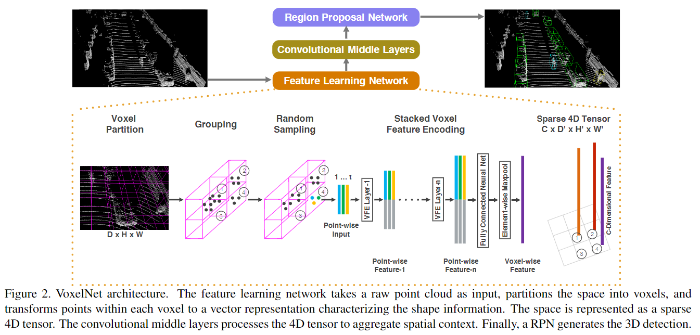
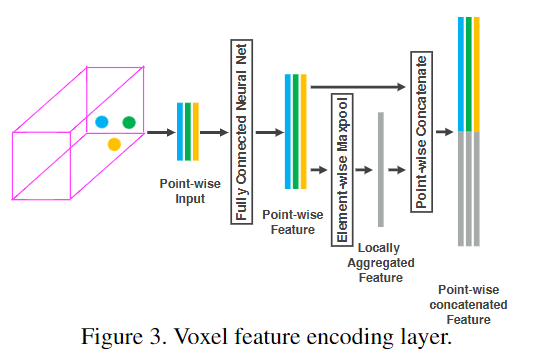

# VoxelNet: End-to-End Learning for Point Cloud Based 3D Object Detection 

## どんなもの?
手作業の特徴量の設計を必要とせず、特徴抽出とオブジェクトの境界ボックスの予測を行う汎用的でEnd-to-Endな3D検知ネットワーク、VoxelNetを提案する。ボクセルによって一定間隔ごとに点群をまとめそれを特徴表現に変換する。

## 先行研究と比べてどこがすごいの?
LiDARの様な100K程の大規模点群を使うような状況でも効率よくオブジェクトを検知できるような効率の良いネットワークを作成する。また、Region proposal network(領域提案ネットワーク)は密でtensor structure(画像、ビデオなど)である必要があり、LiDARのような3Dセンサーは必ずしも全体的に均一な点群を生成しない場合は適応できない。この論文ではそのギャップを埋める。

## 技術や手法のキモはどこ?
図2の様に提案するネットワークは特徴学習ネットワーク、畳み込み中間層、領域提案ネットワークの3つの構造からなる。

### **特徴学習ネットワーク**
以下の1~5までの手順の図は図2にある。

1. **ボクセル分割**  
    ボクセルを分割する。ボクセルのサイズは正六面体でなくても問題なく、3D空間の範囲D, H, Wであり、ボクセルのサイズがvD, vH, vWであるとき、ボクセルの軸ごとの数はD'=D/vD, H'=H/vH, W'=W/vWとなるようにする。

1. **グルーピング**  
    ボクセルごとに点群を分割する。LiDARが点群を取得するため、図2のgroupingのボクセルの様にボクセルごとに保有する点群はまばらである。

1. **ランダムサンプリング**  
    計算の節約とボクセル内の点群の数による偏りを減らすためにT個以下の点群になるようランダムサンプリングする。

1. **スタックボクセル特徴のエンコーディング**  
    図3にボクセル特徴エンコーディング(VFE)層を示す。

    

    ここでボクセルVに含まれる点piにはxyz座標のほかに反射率riを含んでおり、更にローカルな情報としてそれぞれのボクセル中の点群の中央点(vx, vy, vz)があるとすると、ボクセルVinに含まれる点p^iはxi, yi, zi, ri, xi-vx, yi-vy, zi-vzの情報を含める。このp^iはfully connected network(FCN)を介して特徴空間へ変換され、ここで点特徴fiから情報を集約できる。その後、局所集約特徴f~を得るためelement-wise MaxPoolingをfiに使う。最後にfiとf~をPoint-wise concatenated Featureで合体させる。合体させることにより、点ごとの特徴とローカルな特徴を兼ね備えることができる。

    要約すると、VFE層はT個以下の点群を含むボクセルを点ごとの特徴とそのボクセル内のローカル特徴を合体させたものを出力してくれるということである。

1. **スパースなTensor表現**  
    空ではないボクセルのリストを作る。図2の様に、ボクセルごとの特徴の次元がCであるとき、スパースな3D tensorはC\*D'\*H'*W'のサイズとなる。基本的に90%のボクセルは空であり、空ではないボクセル特徴をsuper tensorとして扱うことは学習時のメモリ使用率や計算量を減らすことができる。

### **畳み込み中間層**
畳み込み中間層は、3D畳み込みを適応した層である。畳み込み中間層はボクセル単位特徴を集約し、形状記述のためのコンテキストをより多く与える。

### **領域提案ネットワーク**
点群で論文関連リンクの1の領域提案ネットワークを使うためにいくつか変更を加えた。図4にRPNのアーキテクチャを示す(多分論文関連リンクの1の内容を見たほうが良い)。

### 損失関数  
3Dのground truthボックスをパラメータ化したものをxcg, ycg, zcg, lg, wg, hg, Θgとする。xgc, ycg, zcgは中央座標、lg, wg, hgは全長, 幅, 高さ、Θgはzの軸周りのyaw回転である。

## どうやって有効だと検証した?

## 議論はある?

## 次に読むべき論文は?
-
-

### 論文関連リンク
1. [S. Ren, K. He, R. Girshick, and J. Sun. Faster r-cnn: Towards real-time object detection with region proposal networks. In Advances in Neural Information Processing Sys-tems 28, pages 91–99. 2015.](https://arxiv.org/abs/1506.01497)
2.

### 会議
CVPR 2018

### 著者
Yin Zhou and Oncel Tuzel

### 投稿日付(yyyy/MM/dd)
2017/11/17

## コメント
super tensorの扱いがわからないからなぜ効率が良くなるのかわからない(ただ単に並列処理がしやすいということ?)