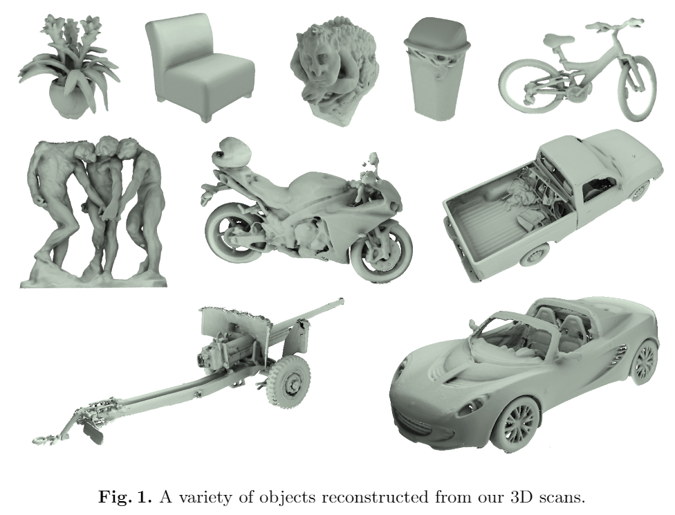

# A Large Dataset of Object Scans

元の論文の公開ページ : [arxiv.org](https://arxiv.org/abs/1602.02481)  
提案モデルの実装 : [intel-isl/redwoord-3dscan](https://github.com/intel-isl/redwood-3dscan)  

Note: 記事の見方や注意点については、[こちら](/)をご覧ください。  
Note: 引用中の[*]は論文内の文献番号である。該当する論文は、論文関連リンクの各リストの末尾に基づいて調べられる。

## どんなもの?
### 実際のオブジェクトの3Dスキャンデータを一万個以上持ったデータセットを用意した。
- オブジェクトデータには靴から屋外彫刻まで様々なものがある。
- このデータセットでは「専門知識を持たない人が消費者向けのRGB-Dカメラを使って屋外室内の現実の単体オブジェクトをスキャンする」というシチュエーションでデータを取得している。
- 以下の図は、取得したスキャンデータから再構築した3Dデータ。すべてのデータに対して再構築を行っているわけではない。

## 先行研究と比べてどこがすごいの? or 関連事項
### 比較として挙げた3つの3Dモデル用のデータセットにある欠点(数やシチュエーション、データの形式等)に対処した。
- [1]のデータセット、B3DO[2]、BigBIRD[3]が挙げられている。論文内で挙げている比較は以下の通り。なお、この比較は「どんなもの?」で述べたように、「単体オブジェクトを一般的な環境でスキャンする」という観点からの比較である。

|Name|本提案|[1]データセット|B3DO|BigBIRD|
|-|-|-|-|-|
|データの数 (個) | 10000以上 | 300 | 849 | 100 |
| データ形式 | RGB-Dビデオ | RGB-Dビデオ (?) | 独立したRGB-D画像 | 固定位置から撮影されたRGB-D画像 |
|撮影環境 | 様々 | 固定 | 様々 | 固定 |

- 提案と比べた場合、他の手法は数が少ない、完全な3Dオブジェクトデータの復元が困難なデータ形式(2.5Dデータとしてなら使える)、撮影環境の制限などがあり、本提案が扱うシチュエーションの観点から不完全であった。
- 各内容の補足は以下の通り。
    - (?)は論文の概要のみしか確認できなかったため。

## 技術や手法のキモはどこ? or 提案手法の詳細
### 現実的なシチュエーション下でデータを集めて公開した。

- データの公開に問題が無いか、弁護士まで雇っている。

### Newcombe et al. [5]中のICPオドメトリのみの使用が起こす問題に、他の手法を組み合わせて対処した。

- [5]の手法に基づく再構築パイプラインを作ったが、[5]で使われているICPオドメトリはsmooth surfacesの存在によってdriftや極端な失敗を起こす傾向にある。
- 収集したデータセットからスキャン内容を再構築する際に頻繁にこの失敗に遭遇した。
- そのため、著者らは[3]の手法をICPオドメトリに組み合わせて利用し、問題に対処した。

## どうやって有効だと検証した?
##### 省略

## 議論はある?
##### 省略

## 次に読むべき論文は?
##### なし

## 論文関連リンク
##### あり
1. Lai, K., Bo, L., Ren, X., Fox, D.: RGB-D object recognition: Features, algorithms, and a large scale benchmark. In: Consumer Depth Cameras for Computer Vision. Springer (2013) [4]
2. Janoch, A., Karayev, S., Jia, Y., Barron, J.T., Fritz, M., Saenko, K., Darrell, T.: A category-level 3-D object dataset: Putting the Kinect to work. In: ICCV Workshops (2011) [2]
3. Singh, A., Sha, J., Narayan, K.S., Achim, T., Abbeel, P.: BigBIRD: A large-scale 3D database of object instances. In: ICRA (2014) [6]
4. Newcombe, R.A., Izadi, S., Hilliges, O., Molyneaux, D., Kim, D., Davison, A.J., Kohli, P., Shotton, J., Hodges, S., Fitzgibbon, A.: KinectFusion: Real-time dense surface mapping and tracking. In: ISMAR (2011) [5]
5. Kerl, C., Sturm, J., Cremers, D.: Robust odometry estimation for RGB-D cameras. In: ICRA (2013) [3]

## 会議, 論文誌, etc.
##### なし

## 著者
##### Sungjoon Choi, Qian-Yi Zhou, Stephen Miller, Vladlen Koltun

## 投稿日付(yyyy/MM/dd)
##### 2016/2/8

## コメント
##### なし

## key-words
##### CV, Implemented, Dataset

## status
##### 省略

## read
##### A, I, M

## Citation
##### 未記入
