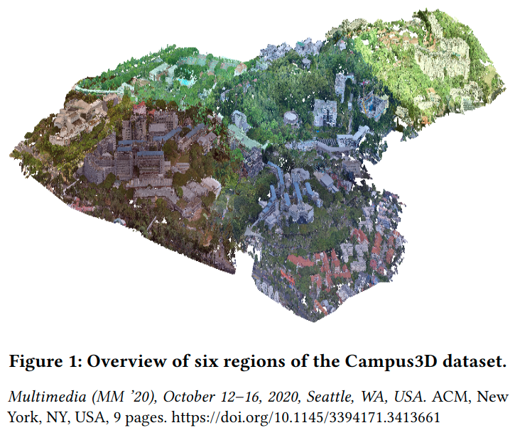
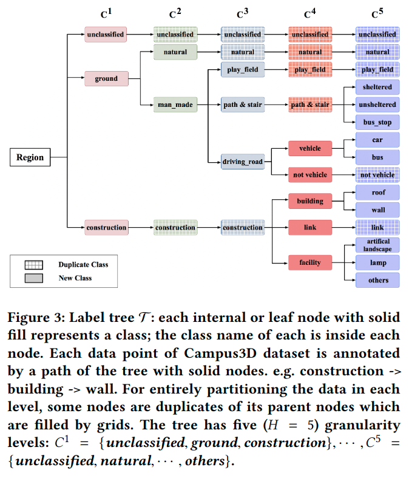

# Campus3D: A Photogrammetry Point Cloud Benchmark for Hierarchical Understanding of Outdoor Scene

元の論文の公開ページ : [arxiv.org](https://arxiv.org/abs/2008.04968)  
提案モデルの実装 : [projectサイト](https://3d.dataset.site/)  

Note: 記事の見方や注意点については、[こちら](/)をご覧ください。  
Note: 引用中の[*]は論文内の文献番号である。該当する論文は、論文関連リンクの各リストの末尾に基づいて調べられる。

## どんなもの?
##### 屋外シーンの点群と、その点群に対応する階層形式のアノテーションデータを付属したデータセットを作成した。
- 写真測量を使用した点群のデータセットを作成した。
  - データの場所と範囲は"National University of Singapore (NUS) campus of $1.58 km^2$ area."
  - データセットの全体像は図1の通り。
  - 
- 更に、CityGML[1]のmultiple levels of details (LoD)に触発され、本提案でもinstanceとsemantic segmentationに対するhierarchical multi-labelsを導入した。
  - これにより、あるデータ内の点がある場合、その点に割り振られるアノテーションはconstruction -> building -> wallになり、レベルが上がるごとに徐々に細かいラベルが割り振られる。
  - その関係性は図3の通り。
  - 

##### また、Consistency Rate (CR)と呼ばれる新しいメトリックを用意した。
- CRは、semantic segmentationのhierarchical learning (HL)問題における新しいメトリックであり、これは名前の細分化レベルの一貫性を保持するためのものである。
  - [意訳気味]
  - [例などもあるがここでは省略、この内容の説明は2ページ目の"The proposed dataset with hierarchical annotations ~"から。]

##### 更に、このデータセットのための深層学習ベンチマークを用意した。
- "(1) semantic segmentation and (2) instance segmentation."
- "For the concern of computational efficiency and compatibility to **point-based models**, we investigate the data prepossess technique and two sampling methods:"
  - "(1) random block sampling (RBS) and "
  - "(2) random centered K nearest neighbor (RC-KNN) sampling."
    - "And the RBS is chosen as the unified sampling method for benchmarks in view of its better performance."

##### Note
- [写真測量を利用した方法を使った理由は1章にあり。]

## 先行研究と比べてどこがすごいの? or 関連事項
##### 省略

## 技術や手法のキモはどこ? or 提案手法の詳細
##### 省略

## どうやって有効だと検証した?
##### 省略

## 議論はある?
##### 省略

## 次に読むべき論文は?
##### なし

## 論文関連リンク
##### あり
1. [Thomas H Kolbe,Gerhard Gröger, and Lutz Plümer. 2005. CityGML:Interoperable access to 3D city models. In Geo-information for disaster management. Springer, 883–899.](https://www.sig3d.org/files/media/downloads/Papers/Gi4Dm_2005_Kolbe_Groeger.pdf)[17]

## 会議, 論文誌, etc.
##### 28th ACM International Conference on Multimedia (ACM MM 2020)

## 著者
##### Xinke Li, Chongshou Li, Zekun Tong, Andrew Lim, Junsong Yuan, Yuwei Wu, Jing Tang, Raymond Huang

## 投稿日付(yyyy/MM/dd)
##### 2020/08/11

## コメント
##### あり
- HL学習はシーングラフに結構役立ちそうな感じがする。

## key-words
##### CV, Paper, Dataset, Point_Cloud, Semantic_Segmentation, Instance_Segmentation, 導入, Implemented

## status
##### 導入

## read
##### A、I

## Citation
##### 未記入
