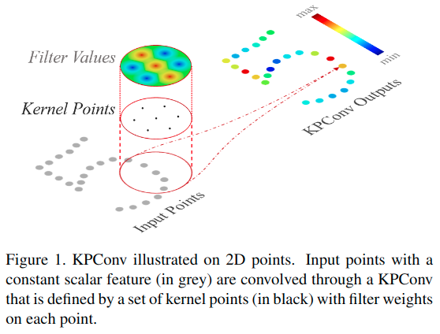

# KPConv: Flexible and Deformable Convolution for Point Clouds

元の論文の公開ページ : [arxiv.org](https://arxiv.org/abs/1904.08889)  
提案モデルの実装 : [HuguesTHOMAS/KPConv](https://github.com/HuguesTHOMAS/KPConv)  

Note: 記事の見方や注意点については、[こちら](/)をご覧ください。

## どんなもの?
##### 新規の点畳込み演算子、Kernel Point Convolution (KPConv)を提案した。
- "KPConv also consists of a set of local 3D filters, but overcomes previous point convolution limitations as shown in related work."
  - [既存の手法もある点を中心として、その周りを畳み込むような演算子を持っている。]
- **"KPConv is inspired by image-based convolution, but in place of kernel pixels, we use a set of kernel points to define the area where each kernel weight is applied, like shown in Figure 1."**
- 
- "The number of kernel points is not constrained, making our design very flexible."
- **"Despite the resemblance of vocabulary, our work differs from [32], which is inspired from point cloud registration techniques, and uses kernel points without any weights to learns local geometric patterns."**
- "Furthermore, we propose a deformable version of our convolution [7], which consists of learning local shifts applied to the kernel points (see Figure 3)."
  - [図3は技術や手法のキモはどこ? or 提案手法の詳細にて。]
- " We use Effective Receptive Field (ERF) [22] and ablation studies to compare rigid KPConv with deformable KPConv."
  - [KPConvには、rigidとdeformable versionがある。]
- "Last but not least, a qualitative study of KPConv ERF shows that deformable kernels improve the network ability to adapt to the geometry of the scene objects."
  - [4.4節より:] "The ERF is a measure of the influence that each input point has on the result of a KPConv layer at a particular location."
    - "To apprehend the differences between the representations learned by rigid and deformable KPConv, we can compute its Effective Receptive Field (ERF) [22] at different locations."

##### 分類、パーツセグメンテーションとセマンティックセグメンテーションにて検証を行った。
- ModelNet40の分類でKPConv rigidが、ShapeNetPartのパーツセグメンテーションでKPConv deformが有用な結果を出した。
- セマンティックセグメンテーションでも検証し、mIoUの指標ではKPConvの両バージョンで良い結果を出した。
  - 検証データセットはScanNet, Semantic3D, S3DIS, Paris-Lille-3Dの4つ。

## 先行研究と比べてどこがすごいの? or 関連事項
- [一部のみ、あくまで主張としてここに残す。]
- "As opposed to [41, 2, 45, 20], we favor radius neighborhoods instead of k-nearest-neighbors (KNN). As shown by [13], KNN is not robust in non-uniform sampling settings. The robustness of our convolution to varying densities is ensured by the combination of radius neighborhoods and regular subsampling of the input cloud [38]. Compared to normalization strategies [13, 14], our approach also alleviates the computational cost of our convolution."
  - "We believe that having a consistent spherical domain for the function g helps the network to learn meaningful representations."
## 技術や手法のキモはどこ? or 提案手法の詳細
### 手法の概要
- 既存の手法のようにKPConvを定義すると、式(1)のようになる。
- $$(\mathcal{F} * g)(x)=\sum_{x_{i} \in \mathcal{N}_{x}} g\left(x_{i}-x\right) f_{i} \tag{1}$$
  - $\mathcal{F} \in \mathbb{R}^{N \times D}$の特徴$f_i$と
  - $\mathcal{P} \in \mathbb{R}^{N \times 3}$の座標$x_i$で定義。
- ここで、KPConvの提案の核となる部分は$g$である。

- [ここ以降は未記入]
- [こちらに詳しい解説あり](http://peluigi.hatenablog.com/entry/2019/04/23/114208)

- $r$をradius neighborhoodsの半径としたとき、$\mathcal{N}_x = \{x_{i} \in \mathcal{P} \mid\|x_{i}-x\| \leqslant r\} \text { with } r \in \mathbb{R}$

## どうやって有効だと検証した?
##### 省略

## 議論はある?
##### 省略

## 次に読むべき論文は?
##### なし

## 論文関連リンク
##### なし
1. [Yiru Shen, Chen Feng, Yaoqing Yang, and Dong Tian. Min-ing point cloud local structures by kernel correlation and graph pooling. In Proceedings of the IEEE Conference on Computer Vision and Pattern Recognition, volume 4, 2018.](https://arxiv.org/abs/1712.06760)[32]

## 会議, 論文誌, etc.
##### ICCV 2019

## 著者
##### Hugues Thomas, Charles R. Qi, Jean-Emmanuel Deschaud, Beatriz Marcotegui, François Goulette, Leonidas J. Guibas.

## 投稿日付(yyyy/MM/dd)
##### 2019/04/18

## コメント
##### あり

## key-words
##### CV, Paper, Implemented, Point_Cloud, Classification, Semantic_Segmentation, 導入, Part_Segmentation, 参照

## status
##### 導入

## read
##### A, I, R

## Citation
##### 未記入
