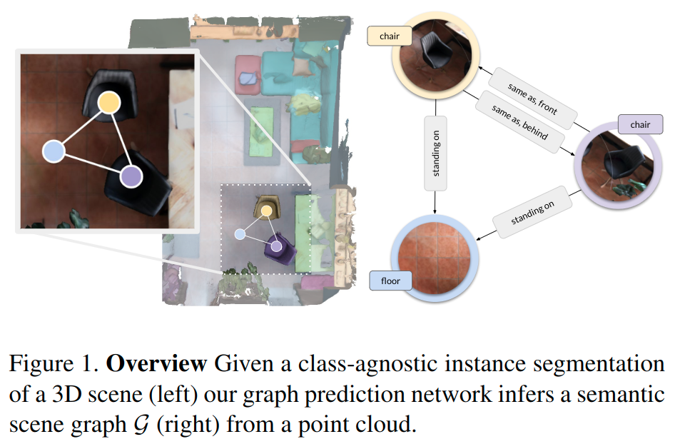

# Learning 3D Semantic Scene Graphs from 3D Indoor Reconstructions

元の論文の公開ページ : [arxiv.org](https://arxiv.org/abs/2004.03967)  
提案モデルの実装 : [なし:2020/4/13]()  
Github Issues :   

Note: 記事の見方や注意点については、[こちら](/)をご覧ください。

## どんなもの?
##### インスタンスセグメンテーションされた点群から3Dシーングラフを予測するモデルを提案する。
- > "We believe that the capability of regressing the scene graph of a given 3D scene can be a fundamental piece for 3D scene understanding, as a way to learn and represent object relationships and contextual information of an environment."
  - > "Our goal is to obtain dense graphs with labeled instances (nodes), semantically meaningful relationships (edges) such as lying on or same as and attributes including color, shape or affordances(see Fig. 1). These resemble the scene graph representation of [17], associated with images."
- > "For this purpose, we propose a learned method, based on PointNet [34] and Graph Convolutional Networks (GCNs) [18], to predict 3D semantic graphs."
- > "Given a class-agnostic instance segmentation of a 3D point cloud, we jointly infer a 3D scene graph composed of nodes (scene components) and edges (their relationships)."
- > "We propose the first learned method that generates a semantic scene graph from a 3D point cloud."

##### 本提案の性能を示すため、3DSSGデータセットを紹介する。
- > "For this purpose, we introduce a 3D semantic scene graph dataset that features detailed semantics in the nodes (instances) including attributes and edges (relationships), which will be publicly released."

##### 3D semanticシーングラフによってクロスドメイン検索する方法を紹介する。
- > "We further show how – in a cross-domain scenario – scene graphs serve as a common encoding between 3D and 2D in a scene retrieval task in changing conditions."

## 先行研究と比べてどこがすごいの? or 関連事項
##### 省略

## 技術や手法のキモはどこ? or 提案手法の詳細
##### 省略

## どうやって有効だと検証した?
##### 省略

## 議論はある?
##### 省略

## 次に読むべき論文は?
##### なし

## 論文関連リンク
##### なし
1. [なし]()[1]

## 会議, 論文誌, etc.
##### CVPR 2020

## 著者
##### Johanna Wald, Helisa Dhamo, Nassir Navab, Federico Tombari.

## 投稿日付(yyyy/MM/dd)
##### 2020/04/08

## コメント
##### なし

## key-words
##### CV, Paper, Point_Cloud, Scene_Graph, Dataset, 導入

## status
##### 導入

## read
##### A, I

## Citation
##### 未記入
