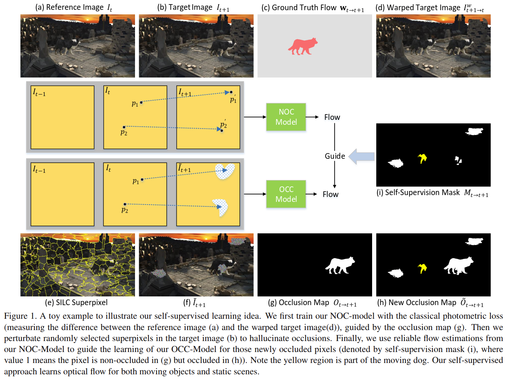

# SelFlow: Self-Supervised Learning of Optical Flow

元の論文の公開ページ : [arxiv](https://arxiv.org/abs/1904.09117)  
Github Issues : [#60](https://github.com/Obarads/obarads.github.io/issues/60)

## どんなもの?
オプティカルフローのためのself-supervised学習を提案した。任意のオクルージョンを用いてオプティカルフローの推定を学習する。

## 先行研究と比べてどこがすごいの?
教師なし学習でオプティカルフローを行う研究がいくつかあるものの、オクルージョンによってうまく学習できないことがあった。最近出てきたDDFlow[1]はself-supervisionのためのオクルージョンを作成するrandom croppingを採用していたものの、全てのナチュラルなオクルージョンには対応することができなかった。

## 技術や手法のキモはどこ? or 提案手法の詳細
著者らのアイデアはsuperpixelに摂動を与えることによって人口オクルージョンを生成する。

## どうやって有効だと検証した?

## 議論はある?

## 次に読むべき論文は?
- なし

## 論文関連リンク
1. [Pengpeng Liu, Irwin King, Michael R. Lyu, and Jia Xu. DDFlow: Learning optical flow with unlabeled data distillation. InAAAI, 2019.](https://arxiv.org/abs/1902.09145)

## 会議
CVPR 2019

## 著者
Pengpeng Liu, Michael Lyu, Irwin King, Jia Xu.

## 投稿日付(yyyy/MM/dd)
2019/04/19

## コメント
なし

## key-words
RGB_Image, Flow_Estimation, Self-Supervised_Learning, CV, Paper, 導入, 旧版

## status
導入

