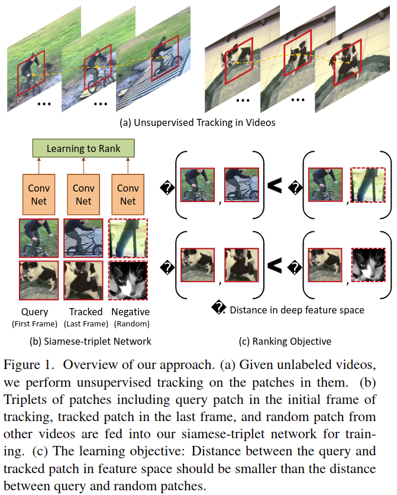

# Unsupervised Learning of Visual Representations using Videos

元の論文の公開ページ : [cvf](https://www.cv-foundation.org/openaccess/content_iccv_2015/papers/Wang_Unsupervised_Learning_of_ICCV_2015_paper.pdf)  
Github Issues : [#127](https://github.com/Obarads/obarads.github.io/issues/127)

## どんなもの?
ラベルなしのビデオで動くオブジェクトをトラッキングし、そのトラッキングしている領域(パッチ画像)をCNNに与えて視覚表現学習を行う教師なし学習手法を提案した。トラッキングで得られるパッチ画像は基本的に同じ単体のオブジェクトもしくはその部分を映し出している。そのため、ビデオ内のトラッキングで得られた複数のパッチ画像は同様の視覚表現を持つように訓練が可能である。本提案の概要は図1の通り。

- (a)ラベルなしビデオから動いているオブジェクトのパッチ画像を教師なしで取得する。
- (b)queryパッチ(トラッキング開始フレームのパッチ)、trackedパッチ(最終フレームのパッチ)、randomパッチ(別のビデオから取ってきたパッチ)を、提案したsiamese-triplet networkに与え学習させる。
- (c)特徴空間におけるqueryパッチとtrackedパッチ間の距離をqueryパッチとrandomパッチ間の距離よりも小さくする。

このsiamese-triplet networkは、(c)の「距離を小さくする」ための損失関数を備えたネットワークであり、構造自体はAlexNetなどの既存のネットワークを使う。

## 先行研究と比べてどこがすごいの?
本提案で学習した手法が様々なタスクで良好な結果を出した。また、深層ネットワークを介したメトリック学習において、既存の手法と違い教師データを必要としない。

[※　どう良好なのか再修正するかも]

## 技術や手法のキモはどこ? or 提案手法の詳細

## どうやって有効だと検証した?

## 議論はある?

## 次に読むべき論文は?
- Self-supervised Visual Descriptor Learning for Dense Correspondence

## 論文関連リンク
1. なし

## 会議
ICCV 2015

## 著者
Xiaolong Wang and Abhinav Gupta

## 投稿日付(yyyy/MM/dd)
2015/05/04

## コメント
なし

## key-words
Self-Supervised_Learning, RGB_Image, Video, CV, Paper, 導入, 旧版

## status
導入

## read
A, I, R

## Citation
