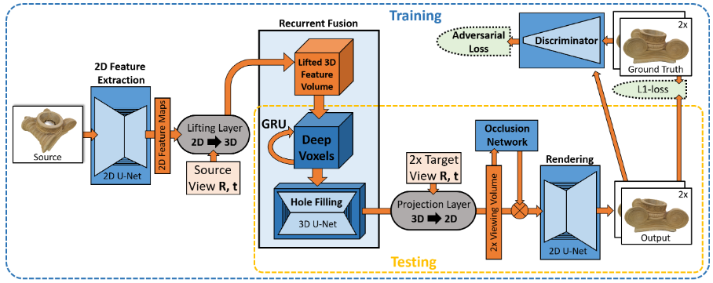

# DeepVoxels: Learning Persistent 3D Feature Embeddings

Cite: [Sitzmann, Vincent, Justus Thies, Felix Heide, Matthias Nießner, Gordon Wetzstein, and Michael Zollhöfer. 2018. “DeepVoxels: Learning Persistent 3D Feature Embeddings.” arXiv [cs.CV]. arXiv. http://arxiv.org/abs/1812.01024.](https://arxiv.org/abs/1812.01024)  
Implementation: [Project page](https://www.vincentsitzmann.com/deepvoxels/)  

## どんなもの?
> In this work, we address the lack of 3D understanding of generative neural networks by introducing a persistent 3D feature embedding for view synthesis. To this end, we propose DeepVoxels, a learned representation that encodes the view-dependent appearance of a 3D scene without having to explicitly model its geometry. (Abst.)

> Figure 1: During training, we learn a persistent DeepVoxels rep-resentation that encodes the view-dependent appearance of a 3D scene from a dataset of posed multi-view images (top). At test time, DeepVoxels enable novel view synthesis (bottom)

## 先行研究と比べてどこがすごいの?
DeepVoxels can generate high-quality novel veiw that depends on the view in 3D space.

## 技術や手法のキモはどこ? or 提案手法の詳細

> Figure 2: Overview of all model components. At the heart of our encoder-decoder based architecture is a novel viewpoint-invariant and persistent 3D volumetric scene representation called DeepVoxels that enforces spatial structure on the learned per-voxel code vectors. 

## どうやって有効だと検証した?

## 議論はある?
省略

## Reference
1. [なし]()

## Note
なし

## key-words
##### CV, RGB_Image, Novel_View_Synthesis, Rendering, Multi-View, WIP_article
