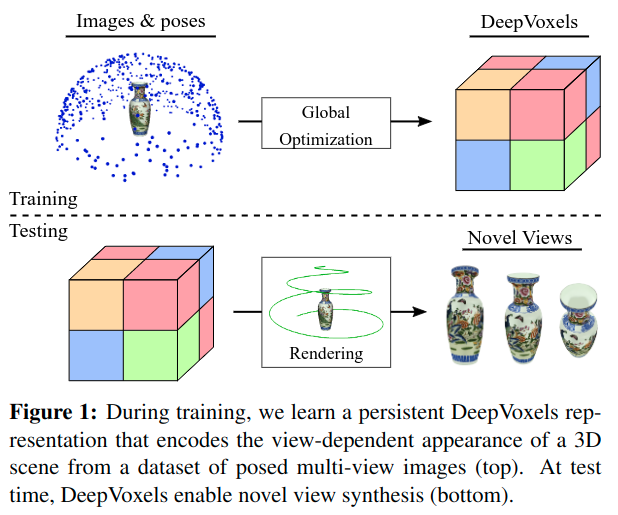

# DeepVoxels: Learning Persistent 3D Feature Embeddings

Cite: [Sitzmann, Vincent, Justus Thies, Felix Heide, Matthias Nießner, Gordon Wetzstein, and Michael Zollhöfer. 2018. “DeepVoxels: Learning Persistent 3D Feature Embeddings.” arXiv [cs.CV]. arXiv. http://arxiv.org/abs/1812.01024.](https://arxiv.org/abs/1812.01024)  
Implementation: [Project page](https://www.vincentsitzmann.com/deepvoxels/)  

## どんなもの?

## 先行研究と比べてどこがすごいの?

## 技術や手法のキモはどこ? or 提案手法の詳細

## どうやって有効だと検証した?

## 議論はある?
省略

## Reference
1. [なし]()

## Note
なし

## key-words
##### CV, RGB_Image, Novel_View_Synthesis, Rendering, Multi-View, WIP_article
