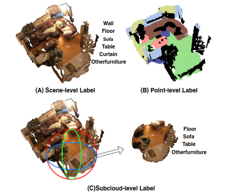
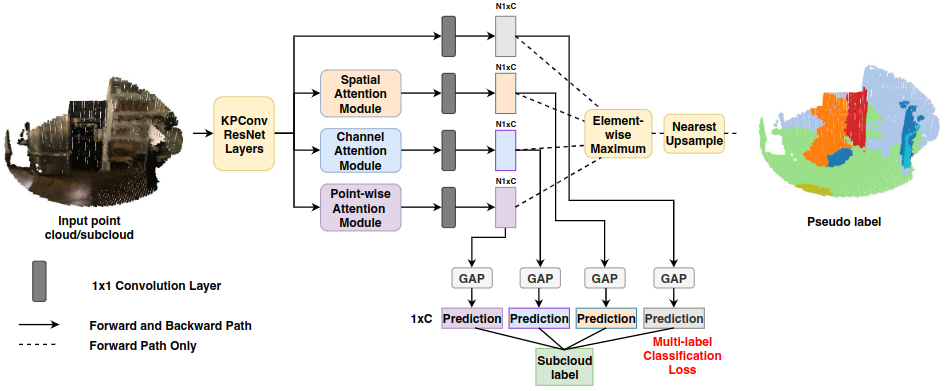

# Multi-Path Region Mining For Weakly Supervised 3D Semantic Segmentation on Point Clouds

Cite: [Wei, Jiacheng, Guosheng Lin, Kim-Hui Yap, Tzu-Yi Hung, and Lihua Xie. 2020. “Multi-Path Region Mining for Weakly Supervised 3D Semantic Segmentation on Point Clouds.” In 2020 IEEE/CVF Conference on Computer Vision and Pattern Recognition (CVPR), 4383–92.](https://openaccess.thecvf.com/content_CVPR_2020/papers/Wei_Multi-Path_Region_Mining_for_Weakly_Supervised_3D_Semantic_Segmentation_on_CVPR_2020_paper.pdf)  
Implementation: [plusmultiply/mprm](https://github.com/plusmultiply/mprm)  

## どんなもの?
> In this paper, we propose a weakly supervised approach to predict point-level results using weak labels on 3D point clouds. We introduce our multi-path region mining module to generate pseudo point-level label from a classification network trained with weak labels.

About weak labels (Note: subcloud-level $\in$ cloud-level):
> we use weak labels that only indicate the classes that appeared in the input point cloud sample.
> We propose a weakly supervised learning approach for 3D point cloud semantic segmentation tasks using only scene- and subcloud-level labels. To the best of our knowledge, this is the first approach to learn a point cloud scene segmentation network from cloud-level weak labels on raw 3D data. 

> Figure 1. An illustration of different kinds of labels for point clouds. (A) Scene-level label indicates all the classes appeared in the scene, (B)Point-level label indicates the class that each pixel belongs to, (C)Subcloud-level label denotes the classes appeared in the subcloud. 

## 先行研究と比べてどこがすごいの?
About Existing methods:
> Thus, these methods still require quite an amount of expensive annotation, and there is no existing method that directly uses weak 3D labels for 3D scene segmentation tasks. 

## 技術や手法のキモはどこ? or 提案手法の詳細
> We introduce our multi-path region mining module to generate pseudo point-level label from a classification network trained with weak labels. It mines the localization cues for each class from various aspects of the network feature using different attention modules. Then, we use the point-level pseudo labels to train a point cloud segmentation network in a fully supervised manner.

> Figure 3. The procedure of pseudo label generation using our multi-path region mining module. We feed the input point cloud/subcloud to the network. Then we use four paths after the backbone network. Each path is a classification head with a different attention module. We take the PCAMs from each path and apply an element-wise maximum on them to get the pseudo labels. 

## どうやって有効だと検証した?
The authors evaluated the proposed model with ScanNet.

## 議論はある?
省略

## Reference
1. [なし]()

## Note
なし

## key-words
##### CV, Point_Cloud, Weakly_Supervised_Learning, Semantic_Segmentation

