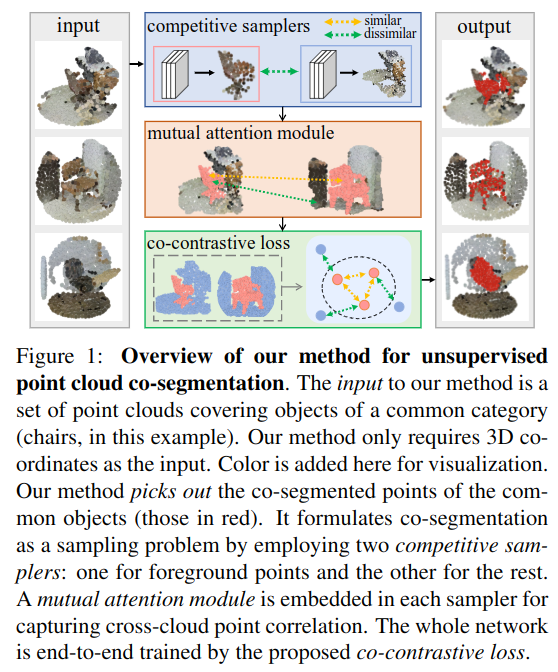

# Unsupervised Point Cloud Object Co-segmentation by Co-contrastive Learning and Mutual Attention Sampling

Cite: [Yang, Cheng-Kun, Yung-Yu Chuang, and Yen-Yu Lin. 2021. “Unsupervised Point Cloud Object Co-Segmentation by Co-Contrastive Learning and Mutual Attention Sampling.” In Proceedings of the IEEE/CVF International Conference on Computer Vision, 7335–44.](https://openaccess.thecvf.com/content/ICCV2021/html/Yang_Unsupervised_Point_Cloud_Object_Co-Segmentation_by_Co-Contrastive_Learning_and_Mutual_ICCV_2021_paper.html)  
Implementation: [jimmy15923/unsup_point_coseg](https://github.com/jimmy15923/unsup_point_coseg)  

## どんなもの?
> This paper presents a new task, point cloud object co-segmentation, aiming to segment the common 3D objects in a set of point clouds.  
> We formulate this task as an object point sampling problem, and develop two techniques, the mutual attention module and co-contrastive learning, to enable it.

Point cloud object co-segmentation is based on 2D image object co-segmentation.

## 先行研究と比べてどこがすごいの?
This paper proposed a new task, point cloud object co-segmentation, and its upsupervised method.

As related works, this paper introduced shape co-segmentation. The differences between object co-segmentation and shape co-segmentation are as follows.
- > First, the tasks differ. Shape co-segmentation decomposes objects into universal parts, while object co-segmentation distinguishes common objects from the back-ground.
- > Second, shape co-segmentation aims to find structural correspondences across shapes of the same category, such as arm-rests of chairs.
- > Third, many shape co-segmentation methods rely on online manual annotation [11] or additional datasets [53]. 

## 技術や手法のキモはどこ? or 提案手法の詳細
> As shown in Figure 1, our method comprises three components to tackle the three aforementioned issues, respectively.
- > First, we cast point cloud co-segmentation as an object point sampling problem.
  - To address foreground-background separation, the authors proposed this sampling problem idea instead of object proposals or saliency detectors.  
    > To address the unavailability of object saliency detectors and object proposals on point clouds, our method casts co-segmentation on point clouds as a foreground point sampling problem and implements contrastive learning to discriminatively derive the samplers. 
- > Second, a mutual attention module is developed to explore point-wise correlation across different point clouds, and is employed by both samplers.
- > Third, a co-contrastive loss is developed to address the lack of data for pre-training and the absence of supervisory signals for co-segmentation.

## どうやって有効だと検証した?
> It is evaluated on the ScanObjectNN and S3DIS datasets and achieves promising results.

## 議論はある?
省略

## Reference
1. [なし]()

## Note
Object co-segmentationに関して先に読んでおきたい論文: 
- [Vicente, Sara, Carsten Rother, and Vladimir Kolmogorov. 2011. “Object Cosegmentation.” In CVPR 2011, 2217–24. IEEE.](https://ieeexplore.ieee.org/document/5995530)
- [Hsu, Kuang-Jui, Yen-Yu Lin, and Yung-Yu Chuang. 2018. “Co-Attention CNNs for Unsupervised Object Co-Segmentation.” In Proceedings of the Twenty-Seventh International Joint Conference on Artificial Intelligence, 748–56. California: International Joint Conferences on Artificial Intelligence Organization.](https://www.ijcai.org/proceedings/2018/104)

## key-words
##### CV, Point_Cloud, Unsupervised_Learning

