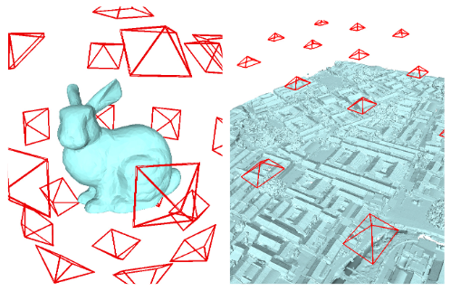

# Vis2Mesh: Efficient Mesh Reconstruction from Unstructured Point Clouds of Large Scenes with Learned Virtual View Visibility

Cite: [Song, Shuang, Zhaopeng Cui, and Rongjun Qin. 2021. “Vis2Mesh: Efficient Mesh Reconstruction from Unstructured Point Clouds of Large Scenes with Learned Virtual View Visibility.” In 2021 IEEE/CVF International Conference on Computer Vision (ICCV). IEEE. https://doi.org/10.1109/iccv48922.2021.00645.](https://ieeexplore.ieee.org/document/9710927)  
Implementation: [GDAOSU/vis2mesh](https://github.com/GDAOSU/vis2mesh)  

## どんなもの?
> We present a novel framework for mesh reconstruction from unstructured point clouds by taking advantage of the learned visibility of the 3D points in the virtual views and traditional graph-cut based mesh generation. (Abst.)

The virtual view is the generated view by this method (camera frustum in following figure, the subject is a point cloud in the task). We can get rendered depth images from a points within the virtual view.

(photo by fig. 3)

## 先行研究と比べてどこがすごいの?
### Existing method
- Classic surface reconstruction
  - local surface smoothness 
    - > The local surface smoothness based methods [12, 16, 1] seek for smooth surface only in close proximity to the data. (Sect. 2)
  - global surface smoothness
    - > The most common global smoothness algorithm is Screened Poisson Surface Reconstruction (SPSR) [21, 22] which can generate smooth, void-free surfaces with high-quality oriented normals, while it can be oversensitive to incorrect normals, as well as non-watertight shapes. (Sect. 2)
    - global surface smoothness: [20, 7, 21, 22, 24]
  - global regularity based methods
    - > The global regularity based methods [33, 56, 27] deal with the man-made objects or architectural shapes that feature symmetry, orthogonality, repetition, and parallelism. (Sect. 2)
    - The data that can be processed is limited.
  - vaisibility based methods
    - > Nonetheless, the quality of results relies on the number and quality of rays and it may fall short in concave areas on the reconstructed surface if insufficient rays are identified [59]. (Sect. 2)
    - ray ≒ view (probably)
    - vaisibility based methods: [11, 25, 45, 19, 32, 26, 17. 18, 59]
- Learning-based surface reconstruction
  - overall problem:
    > As compared to the classic methods, the learning-based methods, in general, demand a high volume of memory and can be scene-specific. (Sect. 2)
  - The author mentions a comparison of each method such as Point2Mesh, Points2Surf.

## 技術や手法のキモはどこ? or 提案手法の詳細

## どうやって有効だと検証した?

## 議論はある?
省略

## Reference
1. [なし]()

## Note
なし

## key-words
##### CV, Point_Cloud, Mesh, Depth_Image, Reconstruction, Rendering, WIP_article

