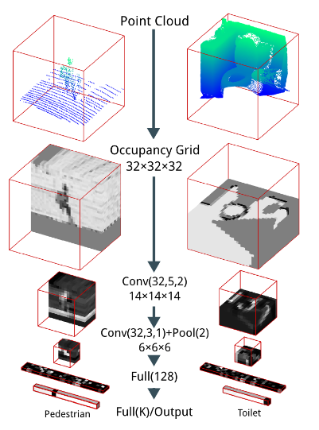
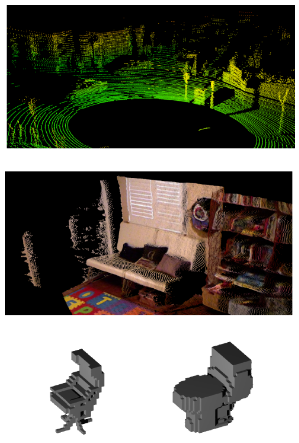

# VoxNet: A 3D Convolutional Neural Network for Real-Time Object Recognition

Cite: [Maturana, Daniel, and Sebastian Scherer. 2015. “VoxNet: A 3D Convolutional Neural Network for Real-Time Object Recognition.” In 2015 IEEE/RSJ International Conference on Intelligent Robots and Systems (IROS). IEEE. https://doi.org/10.1109/iros.2015.7353481.](https://ieeexplore.ieee.org/document/7353481)  
Implementation: [dimatura/voxnet (offficial)](https://github.com/dimatura/voxnet), [AutoDeep/VoxNet (unofficial, TF)](https://github.com/AutoDeep/VoxNet)

## どんなもの?
The authors introduced VoxNet, a supervised 3D Convolutional Neural Network with volumetric Occupancy Grid representation for 3D data (LiDAR point clouds, RGBD point clouds, and CAD models).

## 先行研究と比べてどこがすごいの?
Object Recognition with Point Cloud Data (methods with handcrafted features and classifiers such as SVM):
> Unlike these approaches, our architecture learns to extract features and classify objects from the raw volumetric data. Our volumetric representation is also richer than point clouds, as it distinguishes free space from unknown space. In addition, features based on point clouds often require spatial neighborhood queries, which can quickly become intractable with large numbers of points. (Sect. 2)

2.5D Convolutional Neural Networks:
> Our work differs from these in that we employ a fully volumetric representation, resulting in a richer and more discriminative representation of the environment. (Sect. 2)

3D Convolutional Neural Networks
- Networks for video analysis:
    > Algorithmically, these architectures work the same as ours, but the nature of the data is very different. (Sect. 2)
- Other methods for 3D data
  - Authors mentioned similar method[26]:  
    > In concurrent work, [26] propose a generative 3D convolutional model of shape and apply it to RGBD object recognition, among other tasks. We compare this approach to ours in the experiments. (Sect. 2)
  - For these methods:
    > Compared to this work, we tackle a more general object recognition task with 3D data from different modalities. We also study different representations of occupancy and propose techniques to improve performance when the data varies significantly in scale and orientation. (Sect. 2)

## 技術や手法のキモはどこ? or 提案手法の詳細
### Architecture

> Fig. 1. The VoxNet Architecture. Conv(f; d; s) indicates f filters of size d and at stride s, P ool(m) indicates pooling with area m, and F ull(n) indicates fully connected layer with n outputs. We show inputs, example feature maps, and predicted outputs for two instances from our experiments. The point cloud on the left is from LiDAR and is part of the Sydney Urban Objects dataset [4]. The point cloud on the right is from RGBD and is part of NYUv2 [5]. We use cross sections for visualization purposes.

### Input data format
Why use occupancy grids as input data?
- > First, they allow us to efficiently estimate free, occupied and unknown space from range measurements, even for measurements coming from different viewpoints and time instants. (Sect. 3, A)
- > Second, they can be stored and manipulated with simple and efficient data structures.(Sect. 3, A)

Reference frame and resolution (origin, object orientation, occupancy grid representation resolution)
- origin:
  > we assume it is given as an input, e.g. obtained by a segmentation algorithm or given by a sliding box. (Sect. 3, B)
- orientation:  
  - > we assume that the z axis of the grid frame is approximately aligned with the direction of gravity. (Sect. 3, B)
  - > If we defined a canonical orientation for each object and were capable of detecting this orientation automatically, it would be reasonable to always align the grid to this orientation. (Sect. 3, B)
- resolution:
  - > we adopt two strategies, depending on the dataset. For our LiDAR dataset, we use a fixed spatial resolution, e.g. a voxels of $(0.1m)^3$ . For the other datasets, the resolution is chosen so the object of interest occupies a subvolume of 24 x 24 x 24 voxels. (Sect. 3, B)
    - Reason of 2 resolution
      - > The tradeoff between these two strategies is that in the first case, we maintain the information given by the relative scale of objects (e.g., cars and persons tend to have a consistent physical size); (Sect. 3, B)
      - > in the second case, we avoid loss of shape information when the voxels are too small (so that the object is larger than the grid) or when the voxels are too large (so that details are lost by aliasing). (Sect. 3, B)
  - > In all experiments we use a fixed occupancy grid of size 32 x 32 x 32 voxels. (Sect. 3, B)

Occupancy models (occupancy grid representation as input) are Binary occupancy grid, Density grid and Hit grid.

### Data rotation
The method uses rotation data augmentation and voting strategy for data whose orientation is nontrivial.

> Our representation has no built-in invariance to large rotations; we propose a simple but effective approach to deal with this problem. (Sect. 3, F)

> At training time, we augment the dataset with by creating n copies of each input instance, each rotated $360^\circ / n$ intervals around the z axis.
> At testing time, we pool the activations of the output layer over all $n$ copies. (Sect. 3, F)

### Multiresolution Input
The resolution suitable for classification depends on the object. Therefore, the authors use an architecture inspired by the fovea architecture [24] for rider data.

> Visual inspection of the LiDAR dataset suggested a ($0.2m^3$) resolution preserves all necessary information for the classification, while allowing sufficient spatial context for most larger objects such as trucks and trees. However, we hy-pothesized that a finer resolution would help in discriminating other classes such as traffic signs and traffic lights, especially for sparser data. (Sect. 3, G)

## どうやって有効だと検証した?
> To evaluate VoxNet we consider benchmarks with data from three different domains: LiDAR point clouds, RGBD point clouds and CAD models. Figure 2 shows examples from each.

> Fig. 2. From top to bottom, a point cloud from the Sydney Objects Dataset, a point cloud from NYUv2, and two voxelized models from ModelNet40. 

## 議論はある?
省略

## Reference
1. [なし]()

## Note
なし

## key-words
##### CV, Voxel, Mesh, Point_Cloud, Classification
