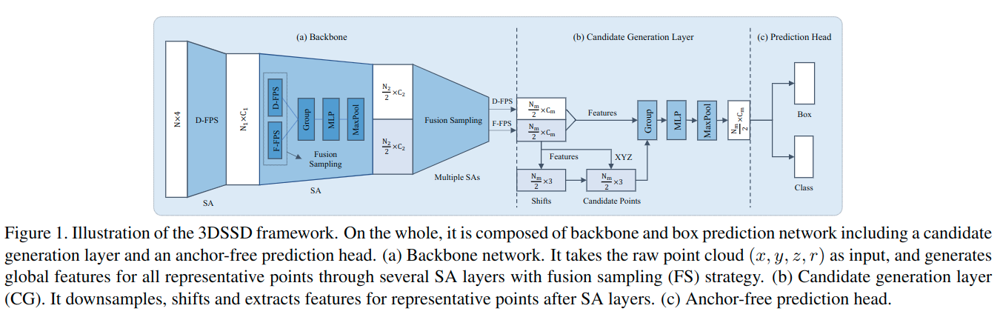

# 3DSSD: Point-based 3D Single Stage Object Detector

元の論文の公開ページ : [arxiv.org](https://arxiv.org/abs/2002.10187)  
提案モデルの実装 : [なし:2020/05/27]()  
Github Issues :   

Note: 記事の見方や注意点については、[こちら](/)をご覧ください。  
Note: 引用中の[*]は論文内の文献番号である。該当する論文は、論文関連リンクの各リストの末尾に基づいて調べられる。

## どんなもの?
##### single stage 3D物体検出モデル、3DSSDを提案した。
- 精度と効率を調律させた軽量のモデルである。
- 効率を上げるため、既存手法で大抵採用されているアップサンプリング層とrefinement stageをすべて省き、計算コストを大幅削減した。
- 少ない代表点での検出を可能にするためのダウンサンプリング処理におけるfusion sampling strategyを提案する。
- また、処理速度は38msほどでありながら、最新のtwo stage手法ほどの精度を持つ。
- contributionは以下の通り。
  - "We first propose a lightweight and effective point-based 3D single stage object detector, named 3DSSD. In our paradigm, we remove FP layers and the refinement module, which are indispensible in all existing point-based methods, contributing to huge deduction on inference time of our framework."
  - "A novel fusion sampling strategy in SA layers is developed to keep adequate interior points of different foreground instances, which preserves rich information for regression and classification."
  - "We design a delicate box prediction network, making our framework both effective and efficient further. Experimental results on KITTI and nuScenes dataset show that our framework outperforms all single stage methods, and has comparable performance to state-of-the-art two stage methods with a much faster speed, which is 38ms per scene."

##### 実験では、車上から取得した点群の3D物体検出データセットを利用した。
- 使用したデータセットは以下の通り。
  - KITTI
  - nuScenes

## 先行研究と比べてどこがすごいの? or 関連事項
##### 省略

## 技術や手法のキモはどこ? or 提案手法の詳細
##### 手法の概要
- 提案モデルの全体像は図1の通り。

## どうやって有効だと検証した?
##### 省略

## 議論はある?
##### なし
- [ただし、Cのみ確認。]

## 次に読むべき論文は?
##### なし

## 論文関連リンク
##### なし
1. [なし]()[1]

## 会議, 論文誌, etc.
##### CVPR2020

## 著者
##### Zetong Yang, Yanan Sun, Shu Liu, Jiaya Jia

## 投稿日付(yyyy/MM/dd)
##### 2020/02/24

## コメント
##### あり
- Iはcontiributionのみ
- Eはデータセットの確認のみ

## key-words
##### Paper, CV, Point_Cloud, Detection, 導入

## status
##### 導入

## read
##### A, I, E, C

## Citation
##### 未記入
