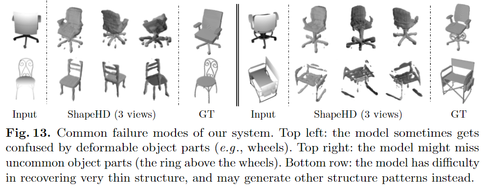

# Learning Shape Priors for Single-View 3D Completion and Reconstruction

元の論文の公開ページ : [arxiv](https://arxiv.org/abs/1809.05068)
Github Issues : [#30](https://github.com/Obarads/obarads.github.io/issues/30)

## どんなもの?
MarrNet[1]で推定された3Dオブジェクトをよりリアルなものに近づけるためのコンポーネントを搭載したShapeHDを提案した。

## 先行研究と比べてどこがすごいの?
より自然な3Dオブジェクトを推定するコンポーネントを提案した。

## 技術や手法のキモはどこ? or 提案手法の詳細
### 構造
提案モデルは3つのコンポーネントからなる。構造は図3の通り。一つ目と二つ目のコンポーネントはMarrNet\(先に読むの推奨\)からなる。

1. 2.5Dスケッチ推定器：入力RGB画像から2.5Dスケッチを推定する。
2. 3D形状推定器：推定した2.5Dスケッチをもとに3Dオブジェクトを推定する。
3. (deep) naturalnessモデル：もし推定した3Dオブジェクトの形状が不自然であるならこれにペナルティーを科す。

MarrNetから新たに付けられたnaturalnessモデルは、教師付き再構築損失だけで訓練されたモデルが生成したぼやけた平均形状を自然にする。

### Shape Naturalness Network
1視点3D形状再構築固有の不確実性により、教師付き損失による形状完成ネットワーク(おそらく訓練したMarrNet)は非現実的な平均的形状を予測する。これは、複数の形状候補が存在するときの損失を最小にするためである。それらの問題を解決するため、非現実的な形状を出すネットワークを罰するdeep naturalness正則化器を導入する。

形状が現実的であるか判断するために3DGANの弁別器を用いる。そのため、まずはGANの事前訓練を行う(生成器は後ほど使わなくなる)。ただし、$128\times 128 \times 128$の高次元3D形状によりGANの訓練は非常に不安定になる。その対策としてWGAN[2]の損失を使う。損失は式(1)の通り。

$$
L_{GAN}= \mathbb{E}_{\tilde{x}\sim P_g}[D(\tilde{x})] - \mathbb{E}_{x \sim P_r}[D(x)]+\lambda\mathbb{E}_{\hat{x}\sim P_x}[(||\bigtriangledown_{\hat{x} } D(\hat{x})||_2-1^2)] \tag{1}
$$

$D$は弁別器、$P_g$と$P_r$はそれぞれ生成された形状の分布と実際の形状の分布である。最後の項はWGANの勾配ペナルティである。最終的には、訓練された弁別器をnaturalness損失として使うため、2番目の項(マイナス付き)を$L_{natural}$として扱うことができる。

### Training Paradigm
トレーニングのステップは2段階であり、初めに3つのコンポーネントをそれぞれ訓練させ、次に(図3の)voxelの損失とnaturalness損失をfine-tuningする。3つのコンポーネントで訓練させるとき、naturalness networkは(いつも通りのGANの)生成器と弁別器を使った敵対的手法で訓練される。

fine-tuning中では、ボクセルの損失とnaturalness損失を足し合わせた損失$L=L_{voxel}+\alpha L_{natural}$を使って訓練される。代替案として、最初の二つのコンポーネントのみ学習させ、学習されたコンポーネントを用いて初期化されたnaturalness networkを訓練する方法があげられる。しかし、この方法はWGANが持つ大きな損失と勾配により、不安定な出力をすることとなるため却下した(つまり、あらかじめWGANをある程度安定させておかなければならないっぽい)。

## どうやって有効だと検証した?
### Single-View Shape Completion
#### Data
ShapeNet Core55[3]のオブジェクトをそれぞれレンダリングして実験する。レンダリングもMarrNetと同じMitsuba render[4]を使って行う。比較対象として、3D-EPN[5]を用意する(公平になるように調節している)。

#### Result
提案手法であるShapeHDのみの視覚的な結果は図4の通り。naturalness損失の切除、3D-EPNなどの結果を視覚的にまとめたものを図5に示す。定量的な結果は表1の通り(ただし3D-EPNの解像度は$32^2$であるため、ShapeHDで推定されたオブジェクトもダウンサンプリングして計測する)。CDはChamfer distanceの略である。

### Analyses
ネットワークがどの部分に注目し、学習しているか調べるためにZhouらの手法[6]を用いて最後の畳み込み層を用いて視覚化する。結果は図11の通り。特定のパターンや曲線などに反応する。図12はnaturalness損失と推定されるオブジェクトの関係、図13は失敗したパターンを示す。薄い形状や、ホイールなどの変形可能な表現、椅子の下のリングなどの珍しい部品などで失敗することが多い。損失は、より多くの負担をもつ厚い形状部分に集中することが見て取れる。

### その他
ほかのデータセットによる評価などいろいろある。

## 議論はある?
なし

## 次に読むべき論文は?
- [Dai, A., Qi, C.R., Niener, M.: Shape completion using 3d-encoder-predictor cnns and shape synthesis. In: CVPR (2017)](https://arxiv.org/abs/1612.00101)

## 論文関連リンク
1. [Wu, J., Wang, Y., Xue, T., Sun, X., Freeman, W.T., Tenenbaum, J.B.: MarrNet: 3D Shape Reconstruction via 2.5D Sketches. In: NIPS (2017)](https://arxiv.org/abs/1711.03129)
2. [Gulrajani, I., Ahmed, F., Arjovsky, M., Dumoulin, V., Courville, A.: Improved training of wasserstein gans. In: NIPS (2017)](https://arxiv.org/abs/1704.00028)
3. [Chang, A.X., Funkhouser, T., Guibas, L., Hanrahan, P., Huang, Q., Li, Z., Savarese, S., Savva, M., Song, S., Su, H., et al.: Shapenet: An information-rich 3d model repository. arXiv:1512.03012 (2015)](https://arxiv.org/abs/1512.03012)
4. [Jakob, W.: Mitsuba renderer (2010)](http://www.mitsuba-renderer.org)
5. [Dai, A., Qi, C.R., Niener, M.: Shape completion using 3d-encoder-predictor cnns and shape synthesis. In: CVPR (2017)](https://arxiv.org/abs/1612.00101)
6. [Zhou, B., Khosla, A., Lapedriza, A., Oliva, A., Torralba, A.: Object detectors emerge in deep scene cnns. In: ICLR (2014)](https://arxiv.org/abs/1412.6856)

## 会議
ECCV 2018

## 著者
Jiajun Wu, Chengkai Zhang, Xiuming Zhang, Zhoutong Zhang, William T. Freeman and Joshua B. Tenenbaum.

## 投稿日付(yyyy/MM/dd)
2018/09/13

## コメント
なし

## key-words
RGB_Image, Voxel, 3D_Estimation, Depth_Image, CV, Paper, 完了, 旧版

## status
完了

