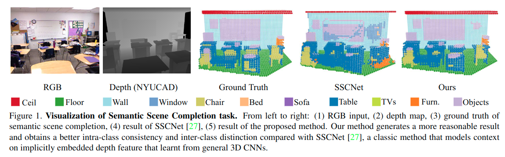

# 3D Sketch-aware Semantic Scene Completion via Semi-supervised Structure Prior

元の論文の公開ページ : [arxiv.org](https://arxiv.org/abs/2003.14052arxiv.org)  
提案モデルの実装 : [charlesCXK/TorchSSC](https://github.com/charlesCXK/TorchSSC)  

Note: 記事の見方や注意点については、[こちら](/)をご覧ください。  
Note: 引用中の[*]は論文内の文献番号である。該当する論文は、論文関連リンクの各リストの末尾に基づいて調べられる。

## どんなもの?
##### 低解像度の3D情報からでも、シーンを復元できるようにするための手法を提案した。
- 本論文では、semantic secne completion(SSC)タスクにおける、低解像度ボクセルの処理によって引き起こるシーンの不完全な復元に対する手法を提案している。
  - [既存のSSCネットワークに対して:]"These methods are either error-prone on classifying fine details of objects or have the difficulties in completing the scene when there exists a large portion of geometry missing, as shown in Figure 1."
  - 
- アイデアは以下の1章の文章に基づく。
  - "In contrast, from the human perception, it is a breeze to complete and recognize 3D scene even from the partial low-resolution observation, due to the prior knowledge on object’s geometry properties, e.g., size and shape, of different categories."
  - "From this perspective, we hypothesize the feature embedding strategy that explicitly encodes the geometric information could facilitate the network learning the concept of object’s structure, and therefore reconstructing and recognizing the scene precisely even from the low-resolution partial observation."
  - "To this end, the geometry properties need to be resolution-invariant or at least resolution-insensitive."
- 上の直感に基づき、3D sketch-aware特徴埋め込みを利用するSSCタスクのための手法を提案する。
  - [1章の"Based on this intuition, we present 3D ~"以降に3D sketchを利用する理由などがあるが、長くなるので省略。]
- **貢献は以下の通り。**
  - "We devise a new geometric embedding from depth information, namely 3D sketch-aware feature embedding, to break the performance bottleneck of the SSC task caused by a low-resolution voxel representation."
  - "We introduce a simple yet effective semantic scene completion framework that incorporates a novel 3D Sketch Hallucination Module to guide the full 3D sketch inference from partial observation via semi-supervised structure prior property of Conditional Variational Autoencoder (CVAE), and utilizes the feature embedded from the hallucinated 3D sketch to further guide the scene completion and semantic segmentation. "
  - "Our model outperforms state-of-the-arts consistently on three public benchmarks, with only requiring 3D volumes of 60×36×60 resolution for both input and output."

## 先行研究と比べてどこがすごいの? or 関連事項
##### 省略

## 技術や手法のキモはどこ? or 提案手法の詳細
##### 省略

## どうやって有効だと検証した?
##### 省略

## 議論はある?
##### 省略

## 次に読むべき論文は?
##### あり
- [Yukai Shi, Keze Wang, Chongyu Chen, Li Xu, and Liang Lin. Structure-preserving image super-resolution via con-textualized multitask learning. IEEE transactions on multi-media, 19(12):2804–2815, 2017.](https://arxiv.org/abs/1707.08340)
  - 3D sketch-aware feature embeddingはいわば境界線(境界線もgeometry)の利用であり、境界線は解像度に依存しない。この依存しないという話に対して、この論文が参考文献として挙げられている。

## 論文関連リンク
##### なし
1. [なし]()[1]

## 会議, 論文誌, etc.
##### CVPR 2020

## 著者
##### Xiaokang Chen, Kwan-Yee Lin, Chen Qian, Gang Zeng, Hongsheng Li

## 投稿日付(yyyy/MM/dd)
##### 2020/03/31

## コメント
##### なし

## key-words
##### CV, Paper, Voxel, Semantic_Segmentation, Reconstruction, RGB_Image, 導入, Implemented

## status
##### 導入

## read
##### A, I

## Citation
##### 未記入
