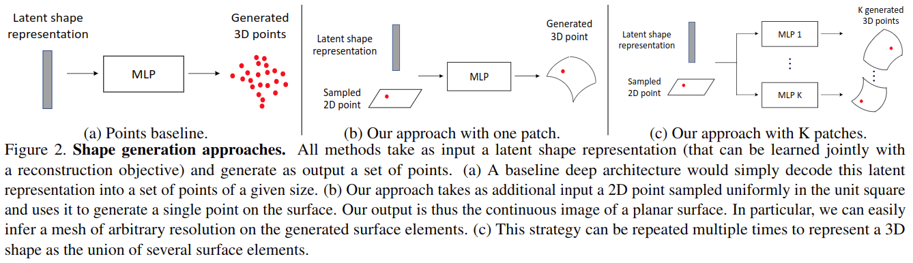

# AtlasNet: A Papier-Mache Approach to Learning 3D Surface Generation

元の論文の公開ページ : [arxiv](https://arxiv.org/abs/1802.05384)  
提案モデルの実装 : [ThibaultGROUEIX/AtlasNet](https://github.com/ThibaultGROUEIX/AtlasNet)  

Note: 記事の見方や注意点については、[こちら](/)をご覧ください。

## どんなもの?
##### ボクセルグリッドや点群を生成するのではなく、3D形状の表面を推定するAtlasNetを提案した。
- この手法では、複数の2Dの正方形(の紙の様なもの)をオブジェクトの表面に合うように変形させることができるパラメータを学習する(図1)。
- 貢献は以下の通り。
  - 3D表面生成への新規アプローチ、AtlasNetを提案した。これらの学習可能なパラメータは、いくつかの紙を張り子に貼るように、2Dの正方形のセットを表面に変換する。この変換パラメータはニューラルネットワークの学習済みの重みと形状学習による表現から成る。
  - 学習済みモデルの変換により、任意の解像度でのサンプリングや、表面へのテクスチャ貼り付けなどができる。
  - 点群と二次元画像から高解像度の表面を抽出することができ、他と比べても性能が良い。
  - いくつかの用途に対して提案手法の可能性を実証する。

## 先行研究と比べてどこがすごいの?
##### 省略

## 技術や手法のキモはどこ? or 提案手法の詳細
##### 省略

## どうやって有効だと検証した?
##### 省略

## 議論はある?
##### 省略

## 次に読むべき論文は?
##### なし

## 論文関連リンク
##### なし

## 会議
##### CVPR 2018

## 著者
##### Thibault Groueix, Matthew Fisher, Vladimir G. Kim, Bryan C. Russell, Mathieu Aubry

## 投稿日付(yyyy/MM/dd)
##### 2018/02/15

## コメント
##### なし

## key-words
##### Point_Cloud, Reconstruction, CV, Paper, 導入, Implemented

## status
##### 導入

## read
##### A, I, R

## Citation
###### github.comより引用
[リンク](https://github.com/ThibaultGROUEIX/AtlasNet)  
@inproceedings{groueix2018,
title={{AtlasNet: A Papier-M\^ach\'e Approach to Learning 3D Surface Generation}},
author={Groueix, Thibault and Fisher, Matthew and Kim, Vladimir G. and Russell, Bryan and Aubry, Mathieu},
booktitle={Proceedings IEEE Conf. on Computer Vision and Pattern Recognition (CVPR)},
year={2018}
}