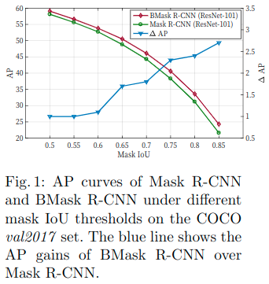

# Boundary-preserving Mask R-CNN 

元の論文の公開ページ : [arxiv.org](https://arxiv.org/abs/2007.08921)  
提案モデルの実装 : [hustvl/BMaskR-CNN](https://github.com/hustvl/BMaskR-CNN)  

Note: 記事の見方や注意点については、[こちら](/)をご覧ください。  
Note: 引用中の[*]は論文内の文献番号である。該当する論文は、論文関連リンクの各リストの末尾に基づいて調べられる。

## どんなもの?
##### オブジェクトの境界線情報を活用して生成されるマスクのlocalization accuracyを改善するBoundary-preserving Mask R-CNN (BMask R-CNN)を提案した。
- "BMask R-CNN contains a boundary-preserving mask head in which object bound-ary and mask are mutually learned via feature fusion blocks. As a result, the predicted masks are better aligned with object boundaries."

##### 検証はCOCO dataset, Cityscapesを使用した。
- "Without bells and whistles, BMask R-CNN outperforms Mask R-CNN by a considerable margin on the COCO dataset;"
  - [bells and whistlesは余計なもの、オプション機能などの意]
- "in the Cityscapes dataset, there are more accurate boundary groundtruths available, so that BMask R-CNN obtains remarkable improvements over Mask R-CNN."
  - [ちなみに、GSCNNでは高解像度な画像とそれに合ったラベルを使用し、よりうまくいったことを主張している。]
- "Besides, it is not surprising to observe that BMask R-CNN obtains more obvi-ous improvement when the evaluation criterion requires better localiza-tion (e.g., AP75) as shown in Fig. 1."
  - 
  - [なぜ?]

## 先行研究と比べてどこがすごいの? or 関連事項
##### 省略

## 技術や手法のキモはどこ? or 提案手法の詳細
##### 省略

## どうやって有効だと検証した?
##### 省略

## 議論はある?
##### 省略

## 次に読むべき論文は?
##### なし

## 論文関連リンク
##### なし
1. [なし]()[1]

## 会議, 論文誌, etc.
##### ECCV 2020

## 著者
##### Tianheng Cheng, Xinggang Wang, Lichao Huang, Wenyu Liu

## 投稿日付(yyyy/MM/dd)
##### 2020/07/17

## コメント
##### なし

## key-words
##### CV, Detection, Instance_Segmentation, RGB_Image, 導入, Paper, Implemented

## status
##### 導入

## read
##### A, I

## Citation
##### 未記入
