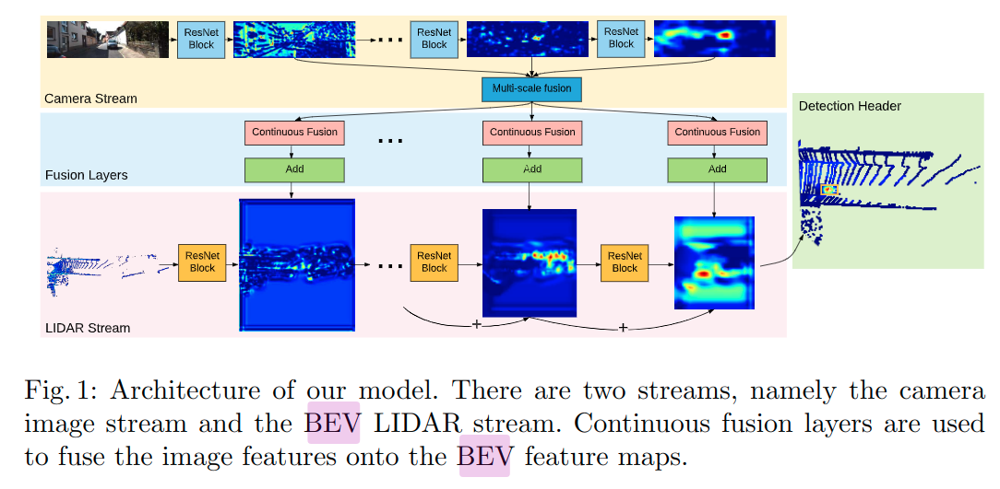
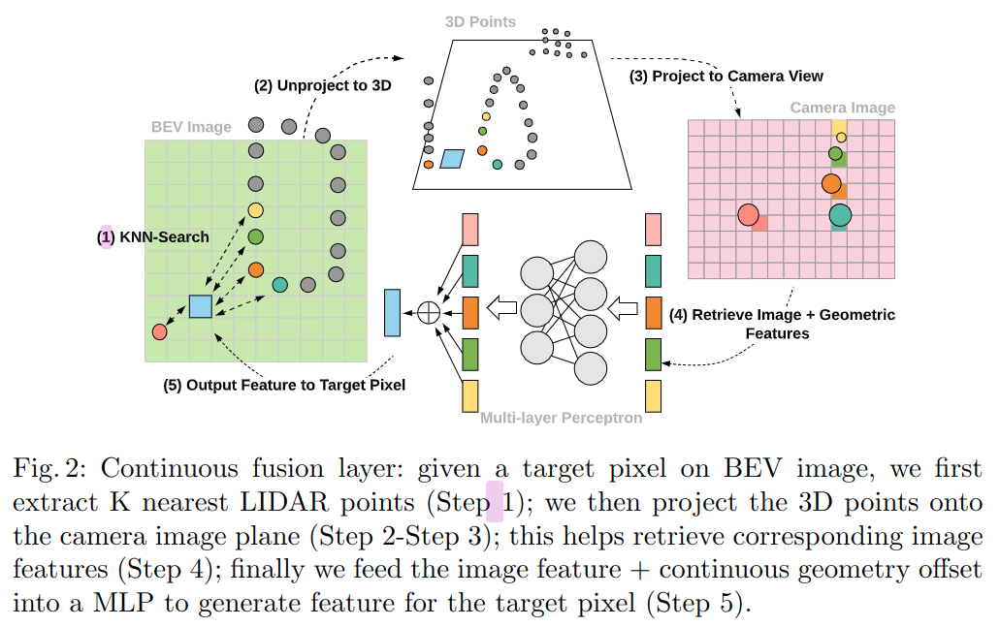

# Deep Continuous Fusion for Multi-Sensor 3D Object Detection

元の論文の公開ページ : [openaccess.thecvf.com/](http://openaccess.thecvf.com/content_ECCV_2018/papers/Ming_Liang_Deep_Continuous_Fusion_ECCV_2018_paper.pdf)  
提案モデルの実装 : [2020:1/4:なし]()  
Github Issues :   

Note: 記事の見方や注意点については、[こちら](/)をご覧ください。

## どんなもの?
##### 画像とLiDARの鳥瞰図の特徴量を融合してオブジェクト検出を行うモデルを提案した。
- 画像はResNet、LiDARは鳥瞰図としてResNetに入力される。
- 鳥瞰図と画像の特徴を投影、逆投影によって組み合わせ、組み合わせた特徴を鳥瞰図に反映するContinuous fusion layerを導入した。

## 先行研究と比べてどこがすごいの? or 関連事項
##### 省略

## 技術や手法のキモはどこ? or 提案手法の詳細
### 手法の概要
- 手法の概要は図1の通り。

##### 1. RGB画像とそれに対応するLiDAR点群を受けとる。
- これらのデータはそれぞれ別のネットワークに入れられる。
  - 図1に示すように、どちらもResNetBlockを使ったネットワーク(Camera streamとLIDAR streamの行)である。

##### 2. RGB画像から得られる画像特徴マップをLIDARの鳥瞰図の特徴と組み合わせる。
- ここにContinuous fusion layerがある。工夫のContinuous Fusion Layerを参照。

##### 3. 最終的に得られる鳥瞰図の特徴マップからオブジェクトの3Dバウンディングボックスを検出する。
- NMSを用いて最終的なバウンディングボックスを出力する。

### 工夫
#### Continuous Fusion Layer
##### この層の目標は画像特徴マップとLIDAARの点群から画像特徴を含む密な鳥瞰図(BEV)特徴マップを生成することである。
- このBEVはLiDARのBEV画像と融合させて扱うための必要となる。
- 処理の流れは図2の通り。
  - 内容は省略

## どうやって有効だと検証した?
##### 省略

## 議論はある?
##### 省略

## 次に読むべき論文は?
##### なし

## 論文関連リンク
##### なし
1. [なし]()[1]

## 会議, 論文誌, etc.
##### ECCV 2018

## 著者
##### Ming Liang, Bin Yang, Shenlong Wang, and Raquel Urtasun

## 投稿日付(yyyy/MM/dd)
##### 2018/??/??

## コメント
##### なし

## key-words
##### Paper, CV, Point_Cloud, Detection, Sensor_Fusion, 省略

## status
##### 省略

## read
##### A

## Citation
##### 未記入
