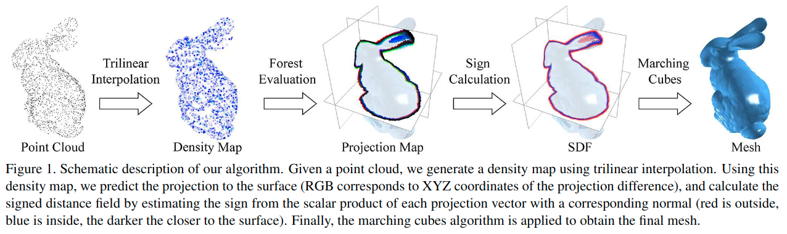

# From Point Clouds to Mesh using Regression

元の論文の公開ページ : [inf.ethz.ch](https://inf.ethz.ch/personal/ladickyl/3d_iccv17.pdf)  
提案モデルの実装 : [2020/1/18:なし]()  
Github Issues :   

Note: 記事の見方や注意点については、[こちら](/)をご覧ください。

## どんなもの?
##### 格子点近傍中の点密度による空間配置に応じた表面への格子点投影の予測を行う、回帰木ベースの手法を提案した。
- [We propose to use a regression forest based method, which predicts the projection of a grid point to the surface, depending on the spatial configuration of point density in thegrid point neighborhood.の直訳。]
  - [あってるのか疑問に思うが、ちょっと見た感じだと]
    - [1. 点密度を用いた特徴量を生成]
    - [2. それを回帰木ベーづの手法に適応して表面予測。]
    - [みたいなものだと思われる。]
  - [本文を真面目に見ないと全容がよくわからない。]

##### 高解像度の3Dモデルの表面を、ミリ単位で予測可能である。
- octreeベースのGPU evalution[(図1の中にあるevalution?)]と適切な特徴ベクトルを設計したため、ミリ秒単位で高解像度の3D点群の表面予測が可能である。

## 先行研究と比べてどこがすごいの? or 関連事項
##### 学習ベースの表面再構築手法としては、この提案が初めてである。
- 直接的には関係しない、Firmanらの手法[1]を除いた場合、本提案が初めてであるということ。

## 技術や手法のキモはどこ? or 提案手法の詳細
##### 省略

## どうやって有効だと検証した?
##### 省略

## 議論はある?
##### 省略

## 次に読むべき論文は?
##### あり
1. [M. Firman, O. Mac Aodha, S. Julier, and G. J. Brostow. Structured prediction of unobserved voxels from a single depth image. In Proceedings of the IEEE Conference on Computer Vision and Pattern Recognition, 2016.](https://discovery.ucl.ac.uk/id/eprint/1533148/1/Firman_structured-prediction-unobserved.pdf)[9]

## 論文関連リンク
##### あり
1. [M. Firman, O. Mac Aodha, S. Julier, and G. J. Brostow. Structured prediction of unobserved voxels from a single depth image. In Proceedings of the IEEE Conference on Computer Vision and Pattern Recognition, 2016.](https://discovery.ucl.ac.uk/id/eprint/1533148/1/Firman_structured-prediction-unobserved.pdf)[9]

## 会議, 論文誌, etc.
##### ICCV 2017

## 著者
##### L’ubor Ladick, Olivier Saurer, SoHyeon Jeong, Fabio Maninchedda, Marc Pollefeys

## 投稿日付(yyyy/MM/dd)
##### 2017/10/22

## コメント
##### なし

## key-words
##### CV, Point_Cloud, Mesh, Reconstruction, Paper, 修正, 導入, w/o_DL

## status
##### 修正

## read
##### A, C

## Citation
##### 未記入

