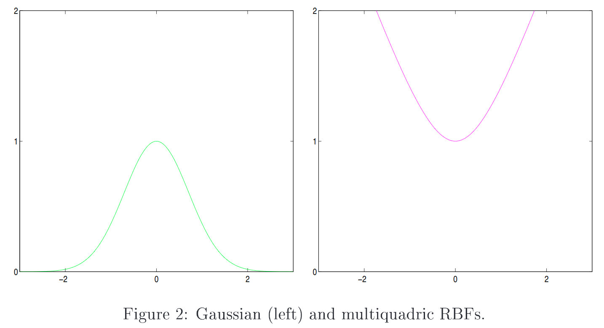
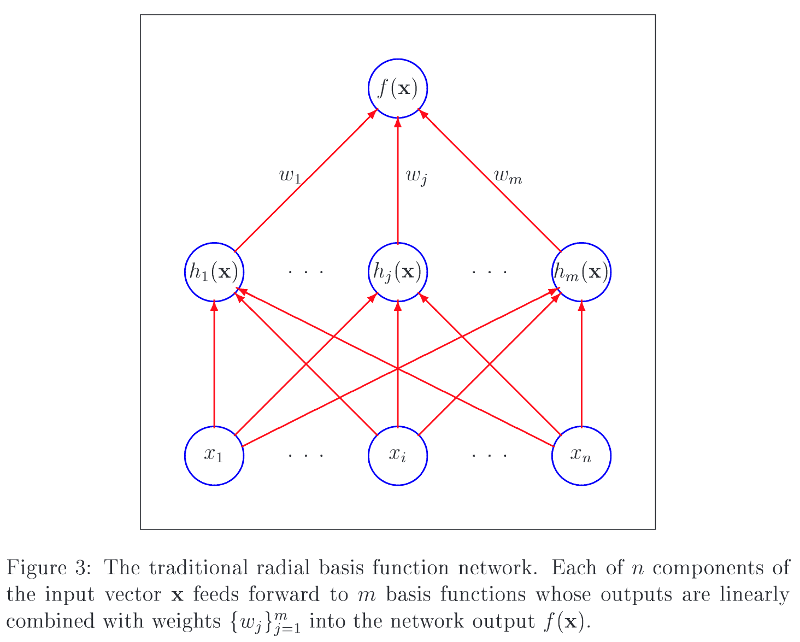

# Introduction to Radial Basis Function Networks

元の論文の公開ページ : [cc.gatech.edu](https://www.cc.gatech.edu/~isbell/tutorials/rbf-intro.pdf)  
提案モデルの実装 : [なし]()  
Github Issues :   

Note: 記事の見方や注意点については、[こちら](/)をご覧ください。

## どんなもの?
##### Radial Basis Function(RBF)ネットワークを中心に取り扱う、線形ニューラルネットワークの資料である。
- [RBFの話をする上で必要な基礎的な内容も載っているっぽい。]
  - [自分は飛ばした。]

## 先行研究と比べてどこがすごいの? or 関連事項
##### 省略

## 技術や手法のキモはどこ? or 提案手法の詳細
- **この記事では、彼らの資料の中でメモしておきたい部分のみ載せる。**

### 3 Linear Models
#### 3.1 Radial Functions
##### Radial FunctionにはGaussianとmultiquadricがある。
- 図2に示すように、Radial functinoは中心点からの距離に応じて単調に増加もしくは減少する反応を返す。
- 典型的なRadial FunctionとしてはGaussianがあり、この方法は中心から遠のくと応答が減少する。
- スカラー入力の場合には以下の数式になる。

$$
h(x)=\exp \left(-\frac{(x-c)^{2}}{r^{2}}\right)
$$

- この式では中心$c$と半径$r$を示す。
- 図2は$c=0$と$r=1$を当てはめたもの。

- 逆にmultiquadric RBFは中心から遠のくと反応が増す。
- スカラー入力の場合、数式は以下のようになる。

$$
h(x)=\frac{\sqrt{r^{2}+(x-c)^{2}}}{r}
$$

- Gaussianの方は中心付近で一番反応を示すため、Multiquadricよりもよく使われている。

#### 3.2 Radial Basis Function Networks
##### RBFネットワークは単層ネットワークにradial functionsを組み合わせる。
- Broomhead and Lowe'sが1988年に発表して以来、図3に示すRBFネットワークが使われる様になった。
- 図3にあるものがRBFネットワーク。$n$個の要素を持つ入力ベクトル$x$は$m$個の基底関数へフィードフォワードされる。
- 基底関数の出力は重み$\\{w_ {j}\\}_ {j=1}^{m}$と線形結合され、ネットワークの出力$f(x)$になる。

- 基底関数がサイズをmoveもしくはchangeできる、もしくは隠れ層が一つ以上である場合はRBFネットワークは非線形になる。
  - [サイズ?move?change?]

## どうやって有効だと検証した?
##### 省略

## 議論はある?
##### 省略

## 次に読むべき論文は?
##### なし

## 論文関連リンク
##### なし
1. [なし]()[1]

## 会議, 論文誌, etc.
##### 不明

## 著者
##### Mark J. L. Orr

## 投稿日付(yyyy/MM/dd)
##### 1996/04/??

## コメント
##### なし

## key-words
##### Technical_Report, Memo

## status
##### 省略

## read
##### なし

## Citation
##### 未記入
