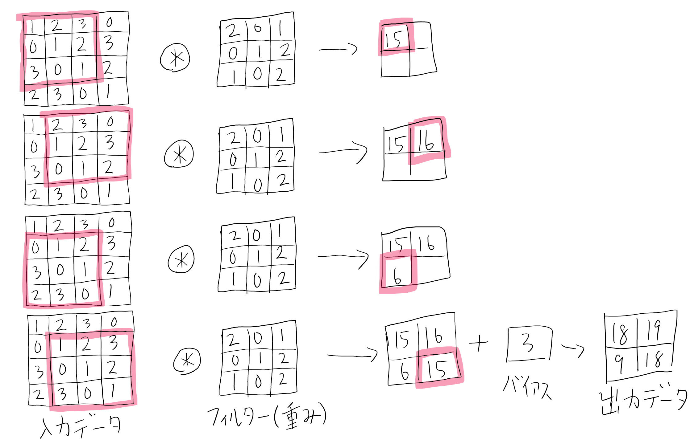
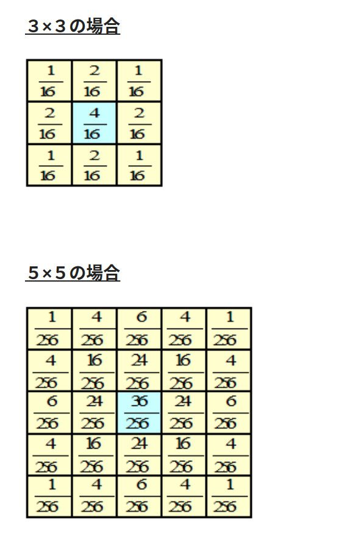

# Kernel (Filter)

Github Issues :   

## 概要
##### 機械学習のKernelについてのメモ
- Kernelの種類とかを知りたい。

## メモの内容
### 畳み込み演算子
- 図1の赤枠とフィルター(重み, カーネル)を要素ごとにかけ合わせ、それらを全て足し合わせた数値が数字として出てくる。
  - 例: $1\times 2 + 2 \times 0 + 3 \times 1 + 0 \times 0 + 1 \times 1 + 2 \times 2 + 3 \times 1 + 0 \times 0 + 1 \times 2 = 15$
- バイアスも足したりする。
- この演算では、カーネルサイズ、ストライド、パディングの3つの値を使う。
- パディングを挟むことにより、出力データの解像度を変化させることができる。
  - パディングの値には0を入れることが多いが、これを0以外の値に置き換えた論文があった気がする。

  
図1 畳み込み演算, [1]より引用

### ガウシアンフィルタ
- ガウス分布の関数(式(1))を用いて計算するのがガウシアンフィルタである。

$$
f(x, y)=\frac{1}{2 \pi \sigma^{2}} \exp \left(-\frac{x^{2}+y^{2}}{2 \sigma^{2}}\right) \tag{1}
$$

- 図2に示すように、ガウス分布のように、中央から徐々に値が小さくなる。
- ガウシアンフィルターにはローパスフィルタと同様の効果があるらしい([2]より)。

  
図2 ガウシアンフィルター, [2]より引用

## 関連リンク
##### なし
1. [斎藤 康毅. ゼロから作るDeep Learning――Pythonで学ぶディープラーニングの理論と実装. 2016.](https://www.oreilly.co.jp/books/9784873117584/)
2. [イメージングソリューション. ガウシアンフィルタ. 2012.](https://imagingsolution.net/imaging/gaussian/)

## 投稿日付(yyyy/MM/dd)
##### 2020/2/22

## コメント
##### なし

## key-words
##### Memo

## status
##### 完了
