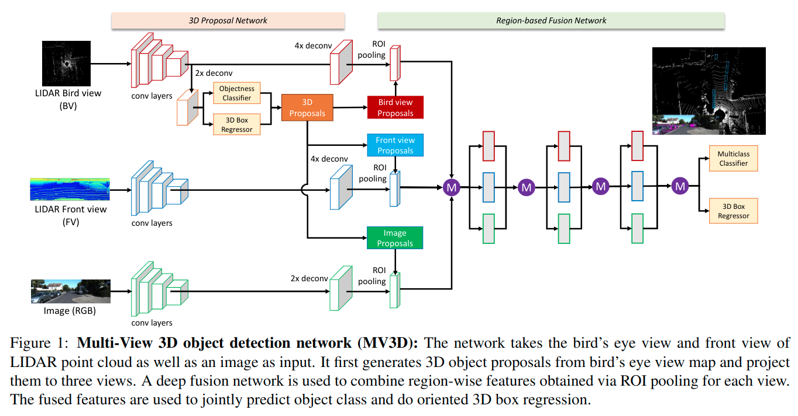

# Multi-View 3D Object Detection Network for Autonomous Driving

元の論文の公開ページ : [arxiv.org](https://arxiv.org/abs/1611.07759)  
提案モデルの実装 : [leeyevi/MV3D_TF](https://github.com/leeyevi/MV3D_TF)  
Github Issues :   

Note: 記事の見方や注意点については、[こちら](/)をご覧ください。

## どんなもの?
##### LiDAR点群とRGB画像を入力とする3D検出器、MV3Dを提案した。
- 最初にBEVを用いて領域提案し、その後LiDARのfront viewとRGB画像、BEVを合成してクラスと3DBBの出力を行う。

## 先行研究と比べてどこがすごいの? or 関連事項
##### 省略

## 技術や手法のキモはどこ? or 提案手法の詳細
### 手法の概要
- 手法の概要は図1の通り。

## どうやって有効だと検証した?
##### 省略

## 議論はある?
##### 省略

## 次に読むべき論文は?
##### なし

## 論文関連リンク
##### なし
1. [なし]()[1]

## 会議, 論文誌, etc.
##### CVPR 2017

## 著者
##### Xiaozhi Chen, Huimin Ma, Ji Wan, Bo Li, Tian Xia

## 投稿日付(yyyy/MM/dd)
##### 2016/11/23

## コメント
##### なし

## key-words
##### CV, Paper, Point_Cloud, Detection, Implemented, 導入

## status
##### 導入

## read
##### A, I

## Citation
##### 未記入
