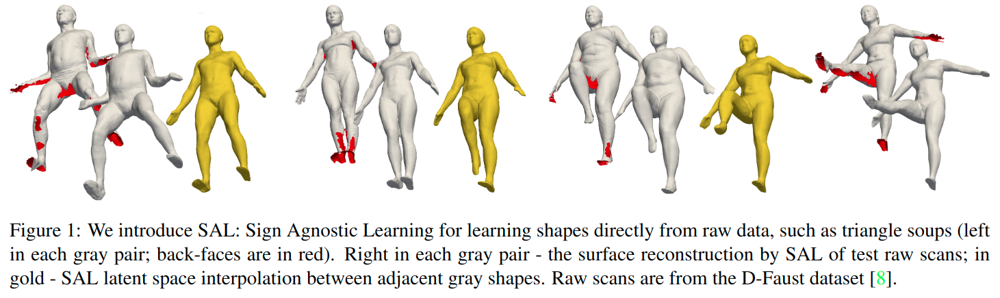

# SAL: Sign Agnostic Learning of Shapes from Raw Data 

元の論文の公開ページ : [arxiv.org](https://arxiv.org/abs/1911.10414)  
提案モデルの実装 : [matanatz/SAL](https://github.com/matanatz/SAL)  

Note: 記事の見方や注意点については、[こちら](/)をご覧ください。  
Note: 引用中の[*]は論文内の文献番号である。該当する論文は、論文関連リンクの各リストの末尾に基づいて調べられる。

## どんなもの?
##### The authors proposed SAL, a deep learning aproach for learning implicit shape representations directly from raw, unsigned geometric data.
- Raw, unsigned geometric data refer to point clouds, triangle soup, etc. 

## 先行研究と比べてどこがすごいの? or 関連事項
##### 省略

## 技術や手法のキモはどこ? or 提案手法の詳細
##### 省略

## どうやって有効だと検証した?
##### 省略

## 議論はある?
##### 省略

## 次に読むべき論文は?
##### なし

## 論文関連リンク
##### なし
1. [なし]()[1]

## 会議, 論文誌, etc.
##### CVPR 2020

## 著者
##### Matan Atzmon, Yaron Lipman

## 投稿日付(yyyy/MM/dd)
##### 2019/11/23

## コメント
##### なし

## key-words
##### CV, Implemented, Point_Cloud, Reconstruction

## status
##### 未完

## read
##### A, I

## Citation
##### 未記入

