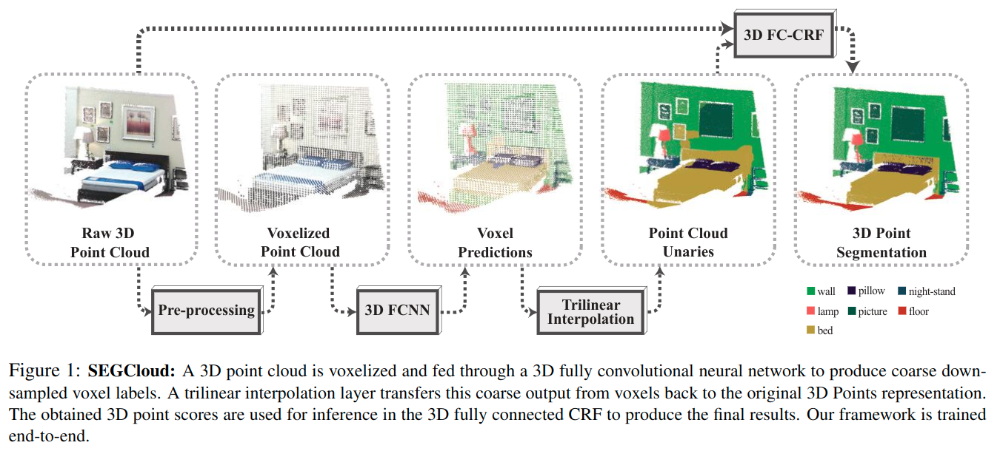

# SEGCloud: Semantic Segmentation of 3D Point Clouds

元の論文の公開ページ : [arxiv.org](https://arxiv.org/pdf/1710.07563.pdf)  
提案モデルの実装 :   
Github Issues :   

Note: 記事の見方や注意点については、[こちら](/)をご覧ください。

## どんなもの?
##### 生の点群からボクセル化を介して、ボクセルレベルではなく点レベルのセマンティックセグメンテーションを行う手法、SEGCloudを提案した。
- 3D Fully Convolutional Neural Networks (3D-FCNN)[1]による3D点群のセグメンテーションを行った後、ボクセルレベルの予測を点レベルの細かい予測に洗練するためにtrilinear interpolation (TI)を使用する。
  - [[1]自体には3Dに関する内容はない?ただ単にこの手法を3D対応させた場合、ボクセルを使った手法になるよということか。]
- また、点の予測に関して意味的一貫性を保つために、Fully Connected Conditional Random Field(FC-CRF)を導入する。

##### 室内&屋外3Dデータセットを用いて、既存の手法よりも良い結果を確認した。
- 使ったデータセットはNYU V2, S3DIS, Semantic3D。

## 先行研究と比べてどこがすごいの? or 関連事項
##### ボクセルレベルのセグメント予測を更に細かい、点レベルの予測に仕上げられる。
- 3D-FCNNではボクセル(grid unit)レベルの粗い出力しか行うことができない。
- 本提案では、TIによりボクセルよりも細かい点レベル出力を行い、その問題を解決する。

##### End-to-Endな学習が可能である。
- 点群のセマンティックセグメンテーションではRandom ForestsとCRFを組み合わせて使うことが多いが、Random ForestsとCRFはここで最適化されるため、Radom ForestsとCRF間で情報(のflow)に制限がかかる。
- 本提案では、End-to-Endに学習を行う。

## 技術や手法のキモはどこ? or 提案手法の詳細
### 手法の概要
- 提案手法の流れは図1の通り。

##### 1. 点群をボクセル化する。
- 3D-FCNNに入力可能な形にするため。

##### 2. ボクセルを3D-FCNNに入力して、ボクセルレベルのクラス確率を得る。
- 特になし。

##### 3. Trilinear interpolation (TI)を用いて、ボクセルから点群へクラスを反映する。
- 特になし。

##### 4. Fully Connected Conditional Random Field (FC-CRF)を使用して点群のラベルを洗練する。
- FC-CRFを使うことで空間的な一貫性を確保しながら3D点群のラベルを推測できる

## どうやって有効だと検証した?
##### 省略

## 議論はある?
##### 省略

## 次に読むべき論文は?
##### なし

## 論文関連リンク
##### あり
1. [J. Long, E. Shelhamer, and T. Darrell. Fully convolutional networks for semantic segmentation. Computer Vision and Pattern Recognition (CVPR), 2015.](https://www.google.com/search?q=J.+Long%2C+E.+Shelhamer%2C+and+T.+Darrell.+Fully+convolutional+networks+for+semantic+segmentation.+Computer+Vision+and+Pattern+Recognition+(CVPR)%2C+2015.&oq=J.+Long%2C+E.+Shelhamer%2C+and+T.+Darrell.+Fully+convolutional+networks+for+semantic+segmentation.+Computer+Vision+and+Pattern+Recognition+(CVPR)%2C+2015.&aqs=chrome..69i57.518j0j7&sourceid=chrome&ie=UTF-8)[42]

## 会議, 論文誌, etc.
##### 3DV 2017

## 著者
##### Lyne P. Tchapmi, Christopher B. Choy, Iro Armeni, JunYoung Gwak, Silvio Savarese.

## 投稿日付(yyyy/MM/dd)
##### 2017/10/20

## コメント
##### あり
- [一貫性についての説明が必要。多分、シーン全体から見て、点群に正しいラベルを割り当てるみたいなものだとは思う。]
- [Rはまだ未確認]
  - [特にCRFによる一貫性の話についての記述を探すべき。その内容は技術や手法のキモはどこ?に書く。]
  - [一貫性は上のEnd-to-Endのこと?いや違うか。]
- [Mはまだ未確認]
  - [Iの最後付近を確認して手法の概要を書いた。]
  - [Mを確認するのであるなら、手法の概要に内容を補足する必要あり]

## key-words
##### CV, Paper, Point_Cloud, Semantic_Segmentation, 導入, Voxel

## status
##### 導入

## read
##### A, I

## Citation
##### 未記入
