# SGPN: Similarity Group Proposal Network for 3D Point Cloud Instance Segmentation

元の論文の公開ページ : [arxiv](https://arxiv.org/abs/1711.08588)
Github Issues : [#47](https://github.com/Obarads/obarads.github.io/issues/47)

## どんなもの?
初の3D点群に対するinstance-awareなセマンティックセグメンテーションが可能なモデルであるSGPNを提案した。SGPNは特徴空間内における点同士の距離に基づく損失、クラスに基づく損失、予測の確信度に基づく損失を扱う。

## 先行研究と比べてどこがすごいの?
初の3D点群に対するinstance-awareなセマンティックセグメンテーションが可能なモデルであるSGPNを提案した。

## 技術や手法のキモはどこ? or 提案手法の詳細
SGPN概要図は図2の通り。この研究の目的は、生の3D点群を入力として受け取り、各点にインスタンスラベルとクラスラベルを振り分けることである。生の点群はPointNetもしくはPointNet++等に渡され、点の特徴を抽出する。この特徴は3つの枝に渡され、枝からそれぞれsimilalarity matrixｍ、confidence map、semantic predictionを得る。損失はこれらの3つの枝の損失の合計$L=L_ {SIM}+L_ {CF}+L_ {SEM}$となる。

### Similarity Matrix
著者らは、正確なインスタンスセグメンテーション結果を直接埋め合わせるためにグループ提案(おそらく、グループ提案はインスタンスが同じ点同士をグループ化する予測のこと)を編成することができる新しいSimilarity Matrix(類似性行列)Sを提案する。点の数を$N_ p$とした時、Sは$N_p \times N_ p$の配列であり、要素$S_ {ij}$は$P_ i$と$P_ j$が同じオブジェクトのインスタンスであるかどうか分類する。$S$の各行は候補のオブジェクトインスタンスを形成する点のグループ提案とみなすことができる。同じインスタンスは同じ特徴を持ち、異なるインスタンスは別々の特徴を持つことを踏まえて$S$は構築される。具体的には点のペア$\\{P_ i,P_ j\\}$の特徴ベクトル$\\{F_ { {SIM}_ i},F_ { {SIM}_ j}\\}$の減算$L_ 2$ノルム$S_ {ij}=||F_ {SIM_ i}-F_ {SIM_ j}||_ 2$によって構築される。

### Double-Hinge Loss for Similarity Matrix
同じインスタンスを持つ点は特徴空間にて近くなればよいというシンプルな目標を用いて最適化する。著者らは各点のペア$\\{P_ i, P_ j\\}$に対して3つ潜在類似度クラスを定義する。以下の行頭数字はクラス番号を指す。

1. $P_ i$と$P_ j$が同じインスタンスに属する。
2. $P_ i$と$P_ j$は同じクラスを持つがインスタンスは異なる。
3. $P_ i$と$P_ j$はクラスもインスタンスも異なる。

これらより、以下の損失を取ることで特徴空間における点の位置が適切なものになる。

$$
L_{S I M}=\sum_{i}^{N_{p} } \sum_{j}^{N_{p} } l(i, j)
$$
$$
l(i, j)=\left\{\begin{array}{ll}{\left\|F_{S I M_{i} }-F_{S I M_{j} }\right\|_{2}} & {C_{i j}=1} \\ {\alpha \max \left(0, K_{1}-\left\|F_{S I M_{i} }-F_{S I M_{j} }\right\|_{2}\right)} & {C_{i j}=2} \\ {\max \left(0, K_{2}-\left\|F_{S I M_{i} }-F_{S I M_{j} }\right\|_{2}\right)} & {C_{i j}=3}\end{array}\right.
$$

この時、$C_ {i j}$は潜在類似度クラスであり、$\alpha$は$\alpha>1$、$K_{1},K_{2}$は$K_{2}>K_{1}$となる。

### Similarity Confidence Network
SGPNは点がその予測にどれくらいの確信度を持っているか示す$N_ p\times 1$のconfidence map $CM$を持っている。図3の(b)は$CM$の結果を反映した点群を示している。色が濃ければ濃いほど自信があるということであり、パーツ間の境界は点の色があせている。  
confidence scoresは$N_ p\times N_ p$のground truth groups $G$に基づいて回帰する。$CM_ i$のground truth値は$G_ i$と$S_ i$のIoU値となり、$L_{CM}$の損失は、そのground truth値と予測した$CM$のL2損失となる。

尚、$P_ i$がどのオブジェクトにも属さない場合(背景の点)は$G_ i$の値が全て0になる。

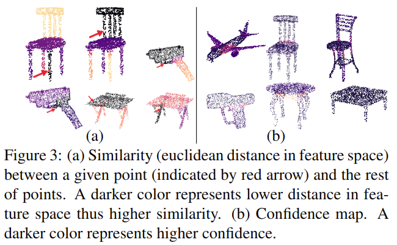

### Semantic Segmentation Map
このmapは点単位のクラス分類子である。そのため、形式は$N_ p\times N_ C$($N_ C$はクラスの数)サイズの行列$M_ {SEM}$として扱われる。このmapの損失は行列の各業のクロスエントロピーのソフトマックス損失の加重和$L_ {SEM}$となる。 median frequency balancingとかも使っているがここでは省略。

### Group Proposal Merging
$S$が生成する$N_ p$のグループ提案にはノイズもしくは他インスタンスとの重複が多くある。そこで、はじめに予測されたconfidence(確信度)が$Th_ C$より少ない or cardinality(濃度?インスタンスに含まれる点の数のことか?)が$Th_ {M2}$より少ない提案は切り捨てる。更に、Non-Maximum Suppressionを適応することで重複を防ぎ、最大cardinalityを有するグループに統合される。もし、最終的なグループの提案に複数のインスタンス候補が残った場合はランダムに決める。

## どうやって有効だと検証した?
### S3DIS Instance Segmentation and 3D Object Detection
S3DISのインスタンスセグメンテーションの結果は表1の通り。また、IoUのしきい値を変動させて精度を測ったものは表2の通り。3D検知は表3、セマンティックセグメンテーションの結果は表4に示される。また、視覚的な結果は図4と図5の通り。

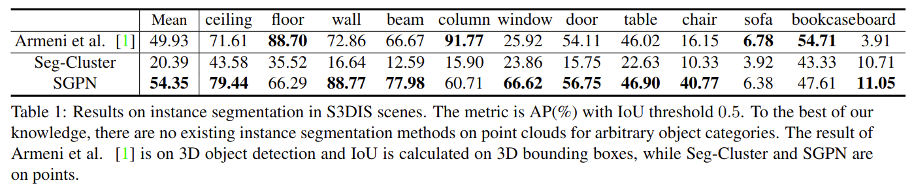

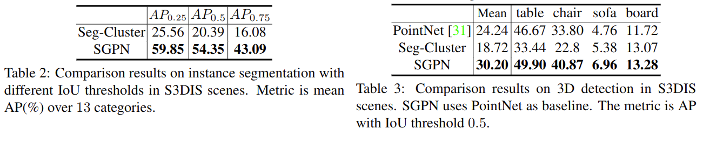

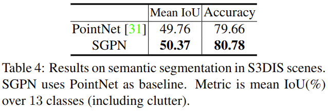

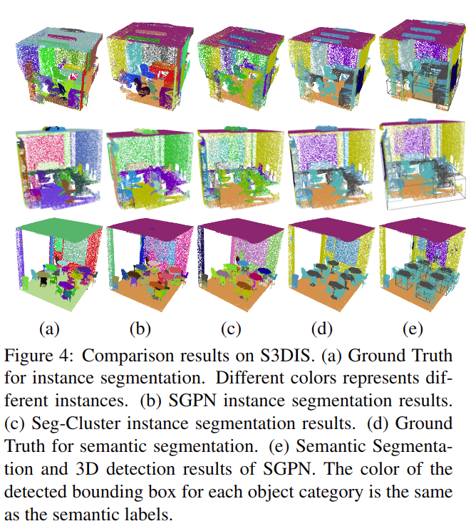

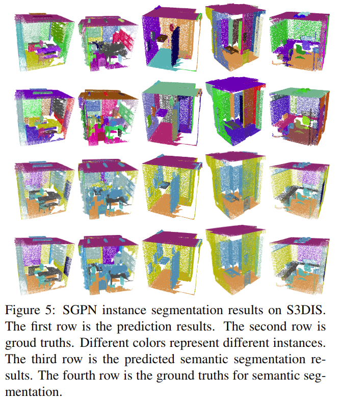

### NYUV2 Object Detection and Instance Segmentation Evaluation
2D CNNの特徴をSGPNと統合してRGB-Dカメラから得たデータの認識精度を上げたSGPN-CNNを提案している。2D CNNには事前訓練されたAlexNetを使用している。SGPN-CNNの構造は図6の通り。データセットにはNYUV2データセットを利用してこれらの比較を行った。結果は表5のとおり。インスタンスセグメンテーションの視覚結果は図7のとおり。3D検知の結果は表6の通り。

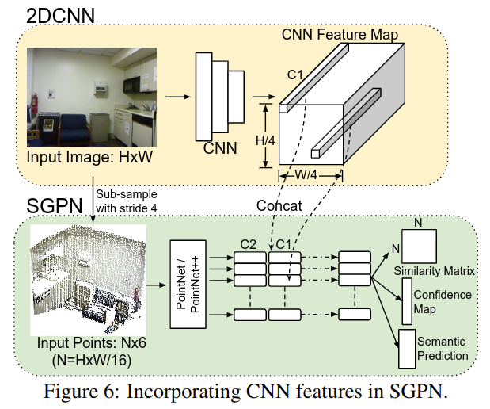

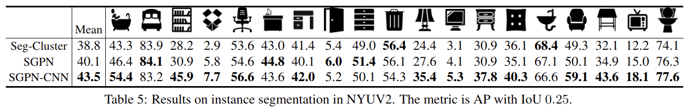

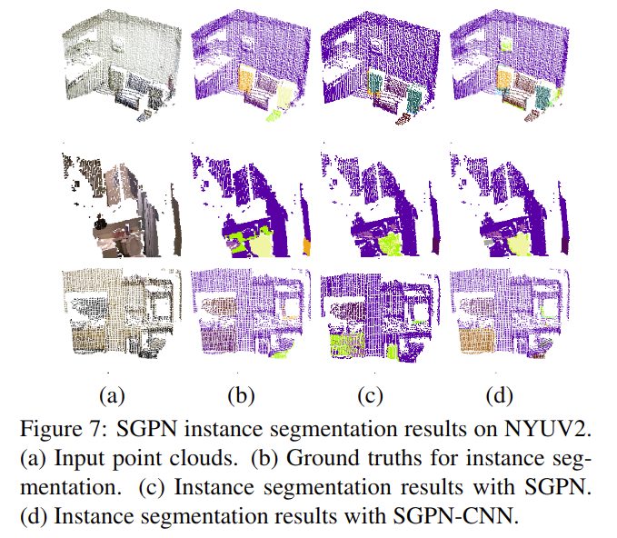

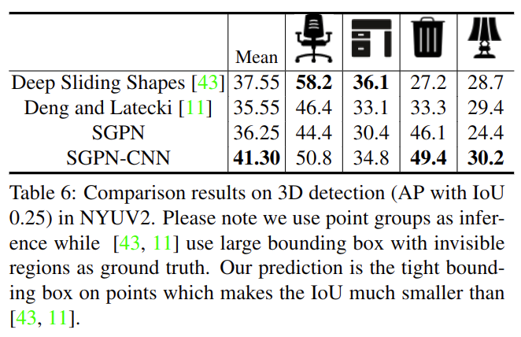

### ShapeNet Part Instance Segmentation
ShapeNetを使って、パーツインスタンスセグメンテーションを行う。結果は表7、視覚的結果は図8の通り。

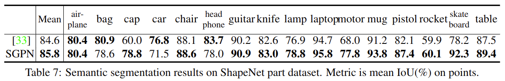

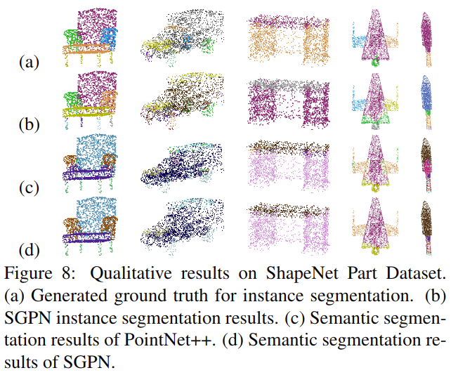

## 議論はある?
$N_ p$の数によってsimilarity matrixのサイズがかなり変わる。その影響でボクセルよりメモリ効率がいいとはいえ$10^5$個以上の点を扱えない。今後の研究の方向性は、類似性行列のサイズを縮小するためにSGPNに基づいて選択されたシード(値)を使用してグループを生成することを検討することができる。

## 次に読むべき論文は?
- GSPN: Generative Shape Proposal Network for 3D Instance Segmentation in Point Cloud

## 論文関連リンク
1. [千葉直也, 戸田幸宏. 三次元点群を取り扱うニューラルネットワークのサーベイ Ver. 2 / Point Cloud Deep Learning Survey Ver. 2 - Speaker Deck. (アクセス:2019/04/29)](https://speakerdeck.com/nnchiba/point-cloud-deep-learning-survey-ver-2?slide=191)
2. [cvpaper.challenge](https://cvpaperchallenge.github.io/CVPR2018_Survey/#/ID_SGPN_Similarity_Group_Proposal_Network_for_3D_Point_Cloud_Instance_Segmentation)

## 会議
CVPR 2018

## 著者
Weiyue Wang, Ronald Yu, Qiangui Huang, Ulrich Neumann.

## 投稿日付(yyyy/MM/dd)
2017/11/23

## コメント
なし

## key-words
Point_Cloud, Instance_Segmentation, Semantic_Segmentation, CV, Paper, 完了, 旧版

## status
完了

