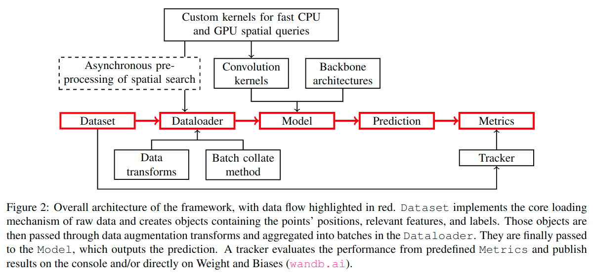
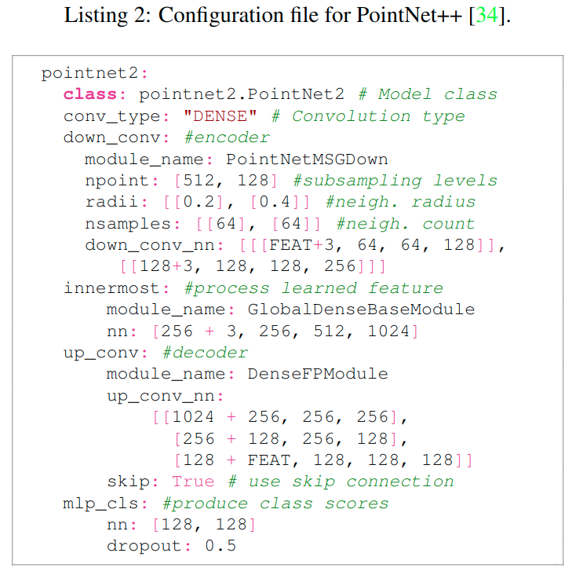
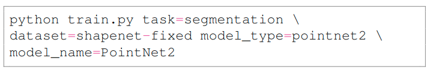
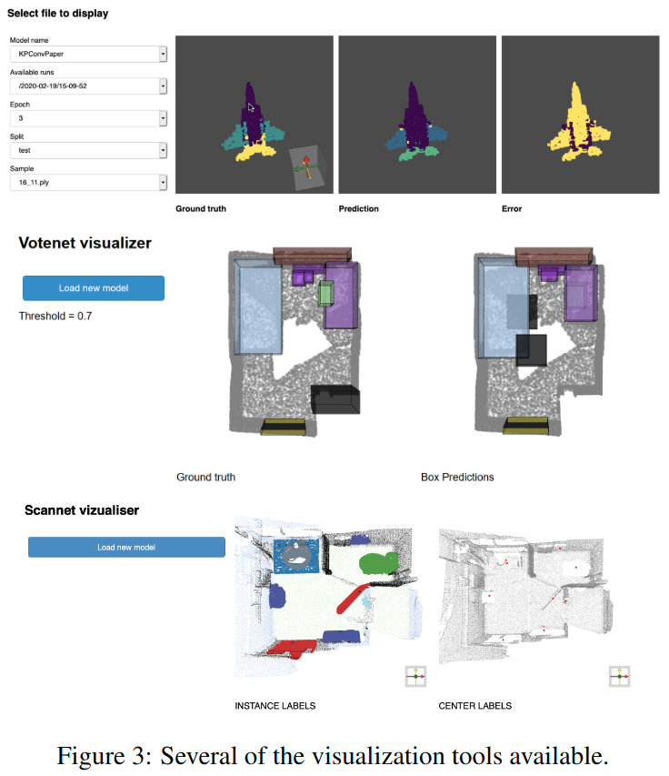

# Torch-Points3D: A Modular Multi-Task Framework for Reproducible Deep Learning on 3D Point Clouds

元の論文の公開ページ : [arxiv.org](https://arxiv.org/abs/2010.04642)  
提案モデルの実装 : [nicolas-chaulet/torch-points3d](https://github.com/nicolas-chaulet/torch-points3d)  

Note: 記事の見方や注意点については、[こちら](/)をご覧ください。  
Note: 引用中の[*]は論文内の文献番号である。該当する論文は、論文関連リンクの各リストの末尾に基づいて調べられる。

## どんなもの?
##### Pytorchを利用した3D点群処理フレームワーク、Torch-Point3Dを提案した。
- 現在の3D研究&開発コミュニティの発展は急速であるものの、これには以下の問題がついている。
  - 新規データセット、タスク、アーキテクチャを既存のアプローチへ追加するには相当の労力が必要であり、これらは再実装することと変わりない。この制限により、新規アーキテクチャの利用に制限がかかり、徹底した比較が妨げられる。
  - 大規模な3Dデータセットを効率的に扱うには、多くの時間を必要とし、また実装のミスを修正する必要がある。これにより、新しいのアイデアの普及に抑制が生じる。
  - 研究論文には推論スキームと評価指標の標準的なアプローチがない。これは、新しいアルゴリズムの固有性能を評価することを難しくし、また再現性を下げる。
- コミュニティの発展に伴うコードの負債に対処できるようにTotch-Point3D(点群処理フレームワーク)の提案を行う。このフレームワークは、いわばtorchvisionの3D点群バージョンみたいなもの。
- このフレームワークでは、上記の問題を克服するため、以下の様な目標がある。
  - 提案されたモデルのモジュールや訓練経過の確認方法を設ける。
  - 結果の再現性(と透明性)、実験の公平性をはっきりわかるようにさせる構造にする。
  - アルゴリズムの開発に集中できるようにデータセットによるテストが容易な環境にする。
  - etc...

## 先行研究と比べてどこがすごいの? or 関連事項
##### 3D点群の深層学習のための統合フレームワークである。
- 3DCV深層学習フレームワークはKaolin、Pytorch3D、Det3D、OpenPCDet、MMDetection3Dなど複数あるが、点群のための複数のタスク、モデル、データセットを併せ持つフレームワークはまだなかった。
- 本提案では、そのようなフレームワークを作る。

## 技術や手法のキモはどこ? or 提案手法の詳細
### 手法の概要
- フレームワークのコンポーネントは図2のように設計されている。  
  
- 処理フローは赤いハイライトに沿って行われる。

##### 1. Datasetでデータ構造の読み込みなどを行う。
- データセットに関しては、ダウンロードから前処理まで様々な処理を行わなければいけない。
- これらの処理に対応するため、pytorch-geometric[1]をベースとした3Dデータセットを扱うためのインターフェイスを提案する。

##### 2. Dataloaderでデータ拡張やバッチ化を行う。
- 1と同じく、データ拡張でもpytorch-geometricをベースとしたインタフェイスを提案する。

##### 3. ModelではDataloaderからの値を読み込む。
- このフレームワークのModelで扱われるネットワークの構成はU-netに従う。これは、PointNet++など点群で扱われるモデルの大部分がU-net likeであるため。
- このアーキテクチャに基づく構成ファイルを使ったシステムを提案する。
- 例えば、PointNet2ではlisting 2のようなコンフィグファイルを利用することでこれに沿ったモデルを構築する。  
  

- 以下のコマンドを利用することで、上記のコンフィグファイルの構成のモデルを利用できるようになる。  
  

##### 4. Predictionでモデルからの予測出力を受け取る。
- 後述する通り、jupyterで利用できる視覚化ツールも備わっている。

##### 5. これらの結果は、Metricsで事前定義された指標によって評価され、wandbなどのロガーに渡される。
- フレームワークで実装されたモデルの結果を比較できるように、Hydra configuration systemとWandbを使用する。
- これは、以下の要項を確認するために利用できる。
  - 実験結果の再現性の確認
  - 実験の透明性の確保
  - データ拡張の利用など、実験環境の公平性の確認
    - [Indeed, the field of 3D analysis lacks a common ground when it comes to evaluation and augmentation strategies, both at test and training time.]
- また、Jupyterで利用できる視覚化ツールも提供する。一例は図3の通り。  
  

## どうやって有効だと検証した?
##### 省略

## 議論はある?
##### 省略

## 次に読むべき論文は?
##### なし

## 論文関連リンク
##### なし
1. [Fey, Matthias and Lenssen, Jan E.. Fast Graph Representation Learning with {PyTorch Geometric. ICLR WS. 2019.](https://github.com/rusty1s/pytorch_geometric)[13]

## 会議, 論文誌, etc.
##### 3DV 2020

## 著者
##### Thomas Chaton, Nicolas Chaulet, Sofiane Horache, Loic Landrieu

## 投稿日付(yyyy/MM/dd)
##### 2020/10/9

## コメント
##### あり
- こんな記事見るより、著者らのGithubの実装見たほうがかなり良い。

## key-words
##### CV, Point_Cloud, Implemented

## status
##### 省略

## read
##### A, I, R, M

## Citation
##### 未記入
